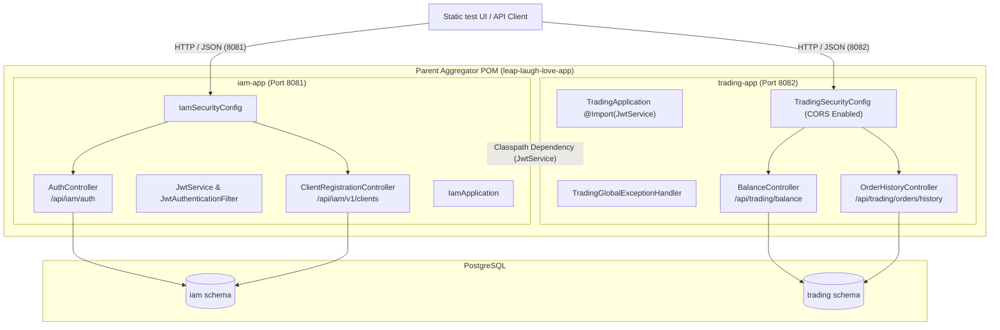
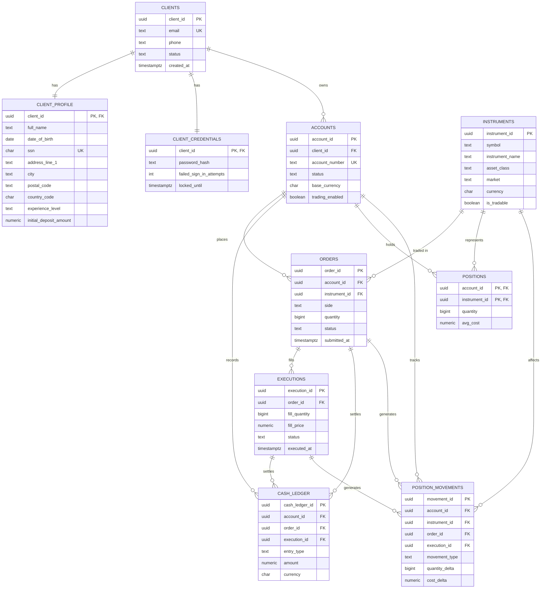

# leap-laugh-love

## Team Members
1. Software Developer - Chris Musselman
2. Team Lead - Nikhil Akula
3. Developer - Yahia Elsaad
4. Database Manager - Lauren Sanday
5. Scrum Master - Elisa Paul

## Branching Strategy
We are using the Trunk branching strategy because it best fits our development strategy and schedule.

---

## Architecture Overview

The repository is structured as a **Multi-Module Maven Project** splitting identity and trading domains into independently deployable microservices:

1. **`iam-app` (Identity Access Management)**: Handles client registration, sign-in, and JWT token issuance. Runs on port `8081`.
2. **`trading-app` (Trading Services)**: Handles account balances, deposits, withdrawals, order management, and trade history. Runs on port `8082`.



---

## API Endpoints Summary

| Module | Endpoint | Description | Permitted / Auth |
|---|---|---|---|
| **IAM** | `POST /api/iam/auth/login` | Client login, returns JWT token | Permitted |
| **IAM** | `POST /api/iam/v1/clients/register` | Client registration | Permitted |
| **IAM** | `GET /actuator/health` | IAM service health check | Permitted |
| **Trading** | `GET /api/trading/balance` | Get balances for authenticated client | Bearer JWT required |
| **Trading** | `POST /api/trading/balance/accounts/{id}/deposit` | Deposit funds | Bearer JWT required |
| **Trading** | `POST /api/trading/balance/accounts/{id}/withdrawal` | Withdraw funds | Bearer JWT required |
| **Trading** | `GET /api/trading/orders/history` | Paginated order history | Bearer JWT required |
| **Trading** | `GET /actuator/health` | Trading service health check | Permitted |

---

## Building and Running

### 1. Build and Run Tests (Maven)

Build all modules and execute the full test suite from the repository root:

```bash
mvn clean verify
```

To build or test individual modules:

```bash
# Test only IAM module
mvn -pl iam-app test

# Test Trading module (with dependency building)
mvn -pl trading-app -am test
```

### 2. Launch Services via Docker Compose (Recommended)

Set your environment variables and launch all containers (`db`, `iam-app`, `trading-app`):

```bash
export JWT_SECRET="your_jwt_secret_key_here_minimum_32_chars"
export DB_PASSWORD="changeme"

docker-compose up -d --build
```

Services will be exposed on:
- **IAM Application**: `http://localhost:8081`
- **Trading Application**: `http://localhost:8082`
- **PostgreSQL Database**: `localhost:5432`

To stop containers and clean up volumes:

```bash
docker-compose down -v
```

### 3. Launch Services Locally (Spring Boot)

Ensure PostgreSQL is running locally on port `5432` with the database `paysprint` (or use active Spring profiles).

Run IAM App:
```bash
mvn -pl iam-app spring-boot:run
```

Run Trading App (in a separate terminal):
```bash
mvn -pl trading-app spring-boot:run
```

---

## ER Diagram



Schema source of truth: `iam-app/src/main/resources/db/leap_laugh_love_schema.sql`. Tables live in two Postgres schemas — `iam` (clients, profiles, credentials) and `trading` (accounts, instruments, orders, executions, cash ledger, positions). Records in `orders`, `executions`, `cash_ledger`, and `position_movements` are append-only/immutable at the database level (delete/update-blocking triggers) to satisfy audit and compliance retention requirements.
