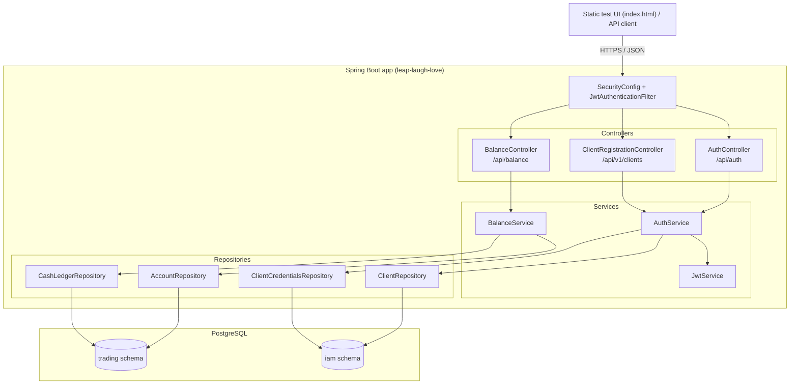
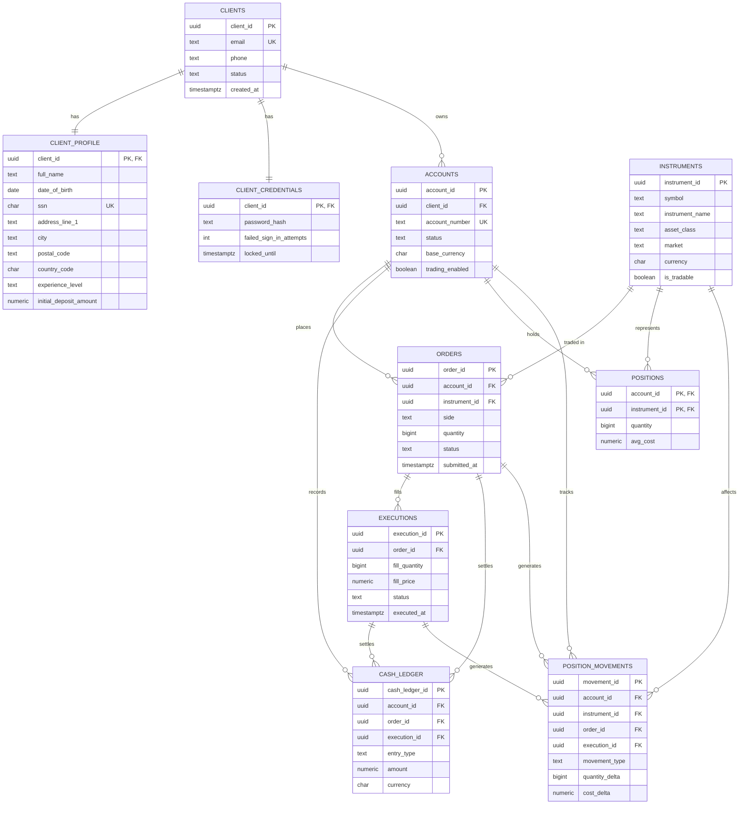

# leap-laugh-love

## Team Members
1. Software Developer- Chris Musselman
2. Team Lead - Nikhil Akula
3. Developer - Yahia Elsaad
4. Database Manager - Lauren Sanday
5. Scrum Master - Elisa Paul
   
## Branching Strategy
We are using the Trunk branching strategy because it best fits our development strategy and schedule.

## Architecture Diagram

`SecurityConfig` permits `/api/auth/**`, `/actuator/health`, and the static test UI without a token; every other route requires a valid JWT bearer token, which `JwtAuthenticationFilter` validates via `JwtService` before the request reaches a controller.

For local development and CI (see `docker-compose.yml` and `Jenkinsfile`), the app and a `postgres:16-alpine` database run as separate Docker containers on a shared bridge network — only the database port is published to the host, and the schema/seed SQL under `src/main/resources/db` is loaded into Postgres automatically on first init.

## ER Diagram

Schema source of truth: [leap_laugh_love_schema.sql](src/main/resources/db/leap_laugh_love_schema.sql). Tables live in two Postgres schemas — `iam` (clients, profiles, credentials) and `trading` (accounts, instruments, orders, executions, cash ledger, positions). Records in `orders`, `executions`, `cash_ledger`, and `position_movements` are append-only/immutable at the database level (delete/update-blocking triggers) to satisfy audit and compliance retention requirements; `clients` rows can never be deleted either, though profile fields and status may still be updated.
