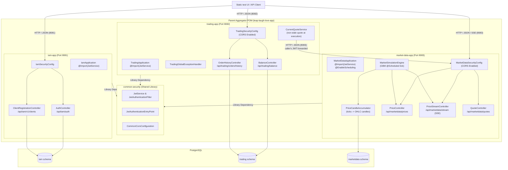
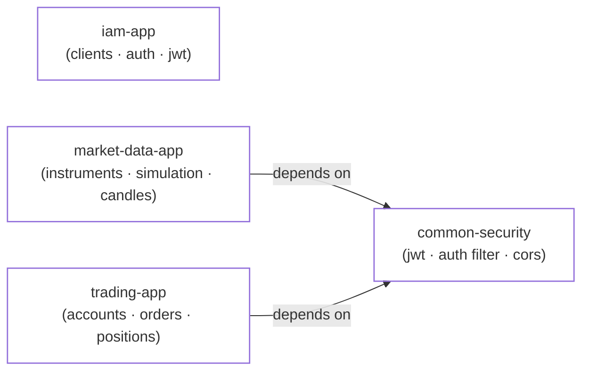
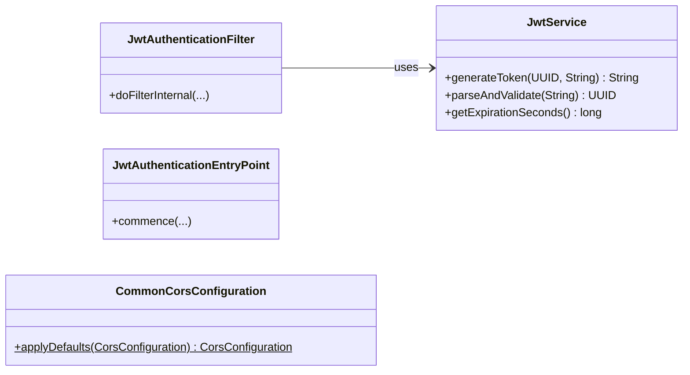
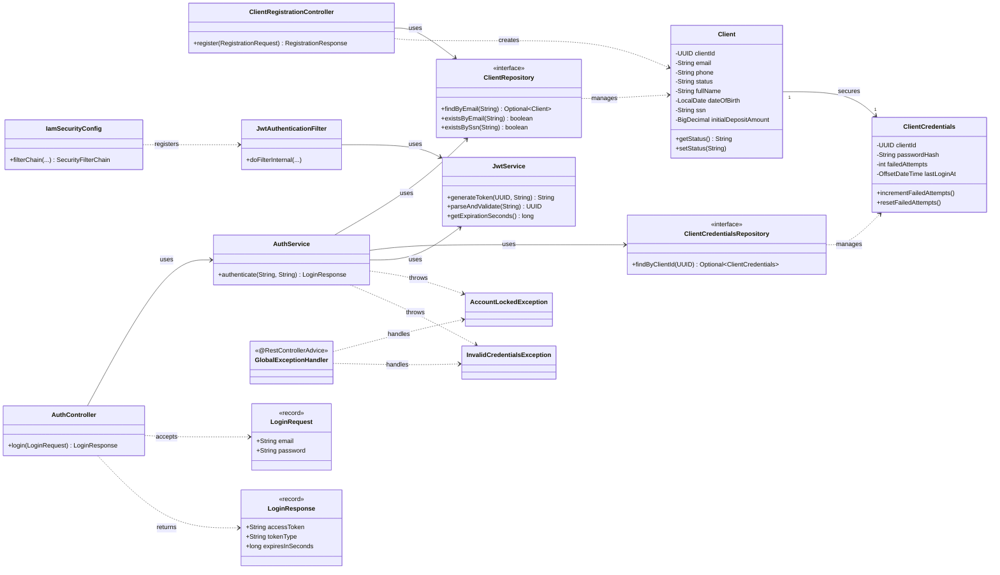
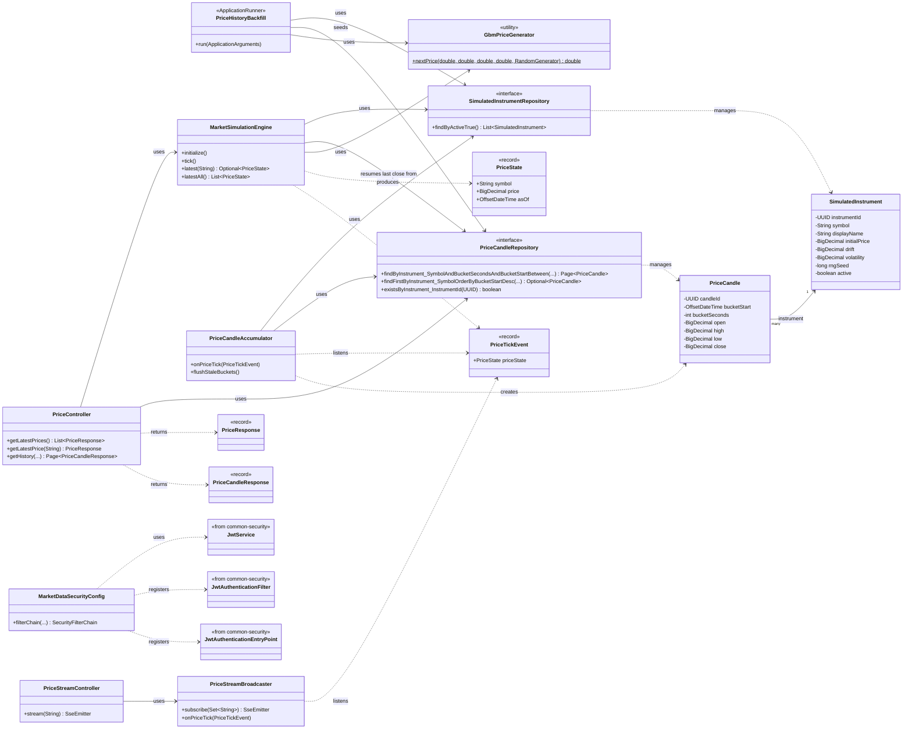
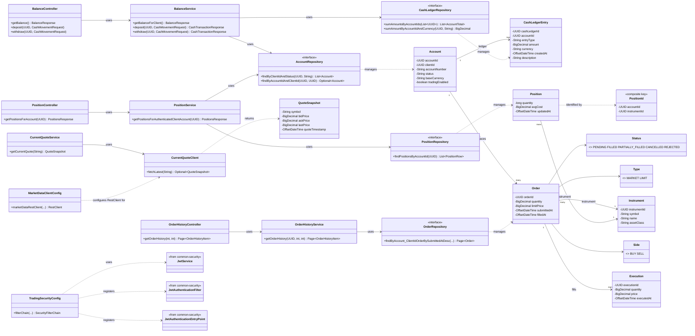
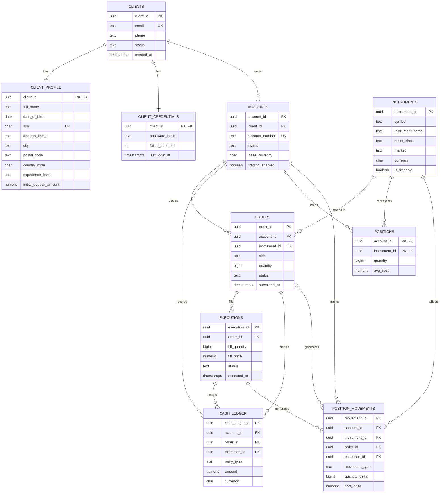

# leap-laugh-love

## Team Members
1. Software Developer - Chris Musselman
2. Software Developer - Nikhil Akula
3. Tech Lead - Yahia Elsaad
4. Scrum Master - Lauren Sanday
5. Software Developer - Elisa Paul

## Branching Strategy
We are using the Trunk branching strategy because it best fits our development strategy and schedule.

---

## Architecture Overview

The repository is structured as a **Multi-Module Maven Project** splitting identity and trading domains into independently deployable microservices along with a shared security library:

1. **`common-security` (Shared Security Library)**: Contains reusable JWT token handling (`JwtService`, `JwtAuthenticationFilter`), 401 JSON error formatting (`JwtAuthenticationEntryPoint`), and shared CORS configuration (`CommonCorsConfiguration`). Packaged as a standard library JAR.
2. **`iam-app` (Identity Access Management)**: Handles client registration, sign-in, and JWT token issuance. Runs on port `8081`.
3. **`trading-app` (Trading Services)**: Handles account balances, deposits, withdrawals, order management, and trade history. Runs on port `8082`.
4. **`market-data-app` (Market Simulation)**: Simulates instrument prices with Geometric Brownian Motion (no external market-data API), keeping a live in-memory price per instrument plus OHLC candle history, exposed via REST and an SSE push stream. Runs on port `8083`.



---

## UML Class Diagrams

Entities, repositories, services and controllers for each module (test sources and DTO getters omitted for legibility). Microservices (`iam-app`, `trading-app`, and `market-data-app`) share `JwtService`, `JwtAuthenticationFilter`, `JwtAuthenticationEntryPoint`, and `CommonCorsConfiguration` from the `common-security` module — those classes are marked `<<from common-security>>` where they appear.

**Legend:** solid arrow (`-->`) = association / field reference · dashed arrow (`..>`) = dependency (calls / uses) · `<<interface>>` = Spring Data repository.

### Reactor overview



### Common Security — `common-security`

`com.leap.leaplaughlove.common.security` — lightweight shared security library providing JWT creation and validation, request authentication filtering, entry point 401 error response handling, and centralized CORS configuration across all services.



### Identity & Access — `iam-app`

`com.leap.leaplaughlove.iam.{client, auth, security, common}` — registers clients (`PB-02`), authenticates with BCrypt plus a failed-attempt lockout, and mints the JWTs every other module verifies.



### Market Data — `market-data-app`

`com.leap.leaplaughlove.marketdata.{instrument, simulation, history, stream, api}` — simulates prices with discretized Geometric Brownian Motion on a scheduler, publishes ticks as Spring events, streams them over SSE, and rolls them up into OHLC candles at several widths. See [Price history and candle widths](#price-history-and-candle-widths) for how history is stored and generated.



### Trading — `trading-app`

`com.leap.leaplaughlove.trading.{account, balance, ledger, order, position, quote, security}` — owns brokerage accounts, an append-only cash ledger, order/execution history, per-account positions, and the current-quote lookup orders are priced against; every endpoint resolves the client from the JWT principal already on the security context.



---

## API Endpoints Summary

| Module | Endpoint | Description | Permitted / Auth |
|---|---|---|---|
| **IAM** | `POST /api/iam/auth/login` | Client login, returns JWT token | Permitted |
| **IAM** | `POST /api/iam/v1/clients/register` | Client registration | Permitted |
| **IAM** | `GET /actuator/health` | IAM service health check | Permitted |
| **Trading** | `GET /api/trading/balance` | Get balances for authenticated client | Bearer JWT required |
| **Trading** | `POST /api/trading/balance/accounts/{id}/deposit` | Deposit funds | Bearer JWT required |
| **Trading** | `POST /api/trading/balance/accounts/{id}/withdrawal` | Withdraw funds | Bearer JWT required |
| **Trading** | `GET /api/trading/orders/history` | Paginated order history | Bearer JWT required |
| **Trading** | `GET /actuator/health` | Trading service health check | Permitted |
| **Market Data** | `GET /api/marketdata/prices` | Latest simulated price for every active instrument | Bearer JWT required |
| **Market Data** | `GET /api/marketdata/prices/{symbol}` | Latest simulated price for one instrument | Bearer JWT required |
| **Market Data** | `GET /api/marketdata/prices/{symbol}/history` | Paginated OHLC candle history; `interval` selects the candle width in seconds (`60`, `300`, `3600`, `86400`, default `60`) | Bearer JWT required |
| **Market Data** | `GET /api/marketdata/stream` | Server-Sent-Events push of live price ticks (optional `?symbols=` filter) | Bearer JWT required |
| **Market Data** | `GET /actuator/health` | Market data service health check | Permitted |

---

## Building and Running

### Quick Start

The database, all three services and the Angular UI, in two commands. Docker is the only
prerequisite - you do not need Node, Java or Maven installed to run the stack.

```bash
cp .env.example .env
docker compose up --build
```

Then open **http://localhost:4200** and sign in with a seeded account:

| Email | Password |
| --- | --- |
| `alice.johnson@leap.com` | `Password123!` |

The first run builds the service images and installs the frontend dependencies, so expect a
few minutes; later runs start in seconds. Frontend edits hot-reload. Backend edits need
`docker compose up --build` to rebuild the image.

Stop with `docker compose down`, or `docker compose down -v` to also drop the database and
force a fresh frontend dependency install next time.

> [!NOTE]
> `.env.example` carries working local-dev defaults, including a placeholder `JWT_SECRET`.
> They are not secrets and are not suitable for any shared or deployed environment.

### 1. Build and Run Tests (Maven)

Build all modules and execute the full test suite from the repository root:

```bash
mvn clean verify
```

To build or test individual modules:

```bash
# Test Common Security module
mvn -pl common-security test

# Test IAM module (with dependency building)
mvn -pl iam-app -am test

# Test Trading module (with dependency building)
mvn -pl trading-app -am test

# Test Market Data module (with dependency building)
mvn -pl market-data-app -am test
```

### 2. Javadoc Documentation Generation

Generate Javadoc documentation across all modules from the repository root:

```bash
mvn compile javadoc:javadoc
```

> [!NOTE]
> In a multi-module Maven project where `iam-app`, `trading-app`, and `market-data-app` depend on the sibling library module `common-security`, invoking `compile` prior to `javadoc:javadoc` (or ensuring artifacts are installed in the local repository) ensures that class files for dependencies in the reactor are built so the Javadoc compiler can resolve classpath types across modules.
> 
> To generate Javadocs for a single module:
> ```bash
> mvn compile javadoc:javadoc -pl iam-app -am
> ```

### 3. Launch Services via Docker Compose (Recommended)

Compose reads configuration from `.env` (copy it from `.env.example` once). To launch every
container - `db`, `iam-app`, `trading-app`, `market-data-app` and `frontend`:

```bash
docker compose up -d --build
```

Override any value by editing `.env`, or per-invocation:

```bash
JWT_SECRET="your_jwt_secret_key_here_minimum_32_chars" docker compose up -d --build
```

Services will be exposed on:
- **Frontend (Angular dev server)**: `http://localhost:4200`
- **IAM Application**: `http://localhost:8081`
- **Trading Application**: `http://localhost:8082`
- **Market Data Application**: `http://localhost:8083`
- **PostgreSQL Database**: `localhost:5432`

The browser talks to `iam-app` and `trading-app` directly on the ports above, so those stay
published even though the `frontend` container itself never calls them. On a remote or
headless host, forward `4200`, `8081` and `8082` - forwarding `4200` alone yields a UI that
cannot sign in.

To run the frontend on its own against an already-running backend:

```bash
docker compose up frontend
```

To stop containers and clean up volumes:

```bash
docker-compose down -v
```

### 4. Launch Services Locally (Spring Boot)

Ensure PostgreSQL is running locally on port `5432` with the database `paysprint` (or use active Spring profiles).

Run IAM App:
```bash
mvn -pl iam-app spring-boot:run
```

Run Trading App (in a separate terminal):
```bash
mvn -pl trading-app spring-boot:run
```

Run Market Data App (in a separate terminal):
```bash
mvn -pl market-data-app spring-boot:run
```

---

## ER Diagram



## Price history and candle widths

The simulation ticks once a second, but ticks are never persisted. They are folded into OHLC
candles at four widths in parallel - **60s, 5m, 1h and 1d** - and a candle is written only when
its bucket rolls over, so a daily candle costs one insert a day rather than one per tick. Which
widths are accumulated is configured by `marketdata.simulation.candle-bucket-seconds`.

`bucket_seconds` is part of the primary key of `marketdata.price_candles` alongside
`instrument_id` and `bucket_start`, because the same instant is legitimately covered by a candle
at every width. Readers always pin one width: `GET /api/marketdata/prices/{symbol}/history` takes
an `interval` parameter, and the width should be chosen to suit the range being charted - a day of
60s candles is 1,440 points, the same day at `interval=300` is 288, which is what a chart can
actually resolve.

| Range charted | Suggested `interval` | Points |
| --- | --- | --- |
| 1 day | `300` | ~288 |
| 1 week | `3600` | ~168 |
| 1 month | `3600` | ~720 |
| 3 months / 1 year | `86400` | ~90 / ~365 |

Storing several widths is what makes long ranges affordable. A year of 60s candles is ~525,000
rows *per instrument*; the same year of daily candles is 365.

### Backfill on first boot

Candle history would otherwise only cover the current process's uptime, leaving every range
longer than that empty. On first boot, `PriceHistoryBackfill` generates a synthetic history for
any instrument that has no candles: one GBM walk per instrument at 60s resolution across the
lookback, with every width folded out of that single walk so the daily, hourly and minute series
agree with each other. Seeded from each instrument's `rng_seed`, so every developer's database
gets the same history.

It runs as an `ApplicationRunner`, which Spring Boot invokes *before* `ApplicationReadyEvent`.
That ordering matters: `MarketSimulationEngine.initialize()` resumes each instrument from its
newest persisted candle close, so the live feed opens where the generated history ended instead
of jumping back to the seed price. (Resuming also fixes a restart artifact that predates the
backfill - every restart used to snap prices back to their seed value, leaving a sawtooth in the
candle table that no market movement produced.)

Configured under `marketdata.history.backfill`: `enabled` (default `true`), `step-seconds`, and
`tiers` as `bucketSeconds:lookbackDays` pairs (default `86400:365,3600:90,300:7,60:2`, about
7,400 rows per instrument). It is idempotent per instrument, so it is a no-op on every boot after
the first.

> [!NOTE]
> Seed files are mounted into `/docker-entrypoint-initdb.d`, which Postgres only runs on an empty
> data directory. After changing `db/seed_marketdata.sql` (or any other seed), run
> `docker compose down -v` before `docker compose up` or the changes will not be applied. Note
> that `docker-compose.yml` mounts the **`iam-app`** copy of the seed files; the copies under
> `market-data-app` and `trading-app` are kept in step for module-local use.

---

Schema source of truth: `iam-app/src/main/resources/db/leap_laugh_love_schema.sql`. Tables live in three Postgres schemas — `iam` (clients, profiles, credentials), `trading` (accounts, instruments, orders, executions, cash ledger, positions), and `marketdata` (simulated instruments and OHLC price candles — decoupled from `trading.instruments`, matched only by symbol; `marketdata.instruments` also carries index/benchmark symbols such as `SPX` and `VIX` that quote and chart but, having no `trading.instruments` row, can never be ordered). Records in `orders`, `executions`, `cash_ledger`, and `position_movements` are append-only/immutable at the database level (delete/update-blocking triggers) to satisfy audit and compliance retention requirements.
