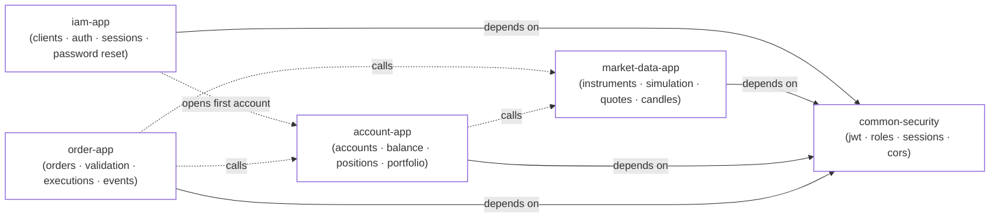
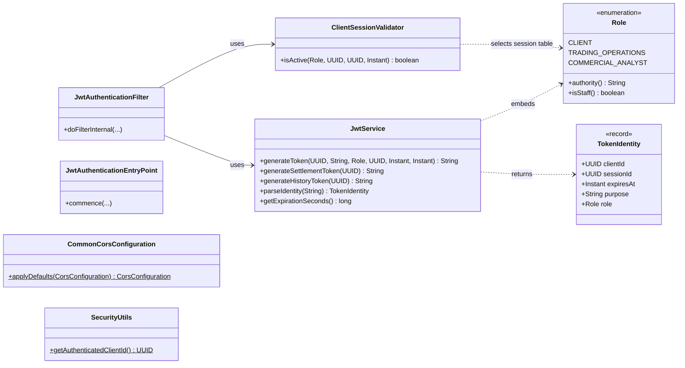
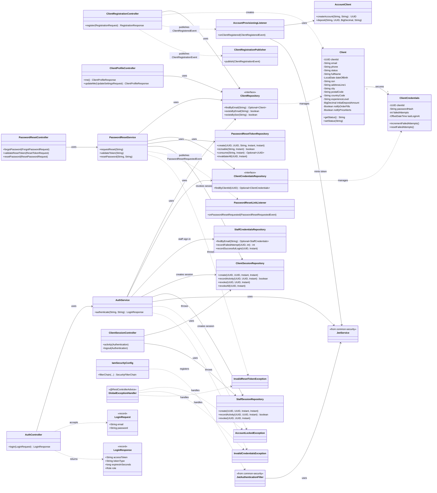
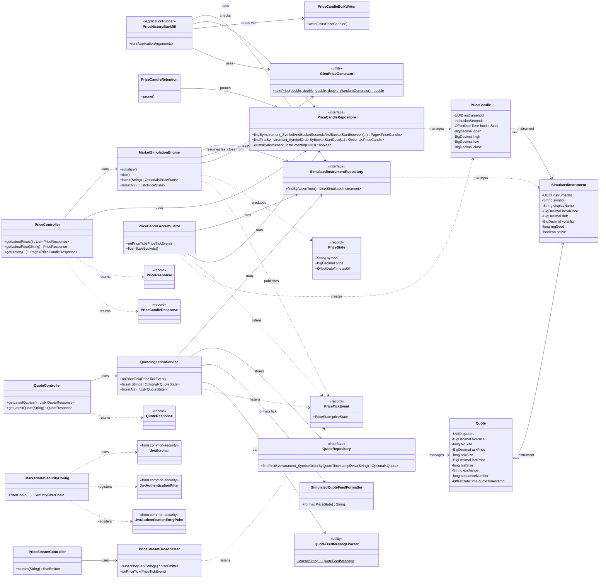
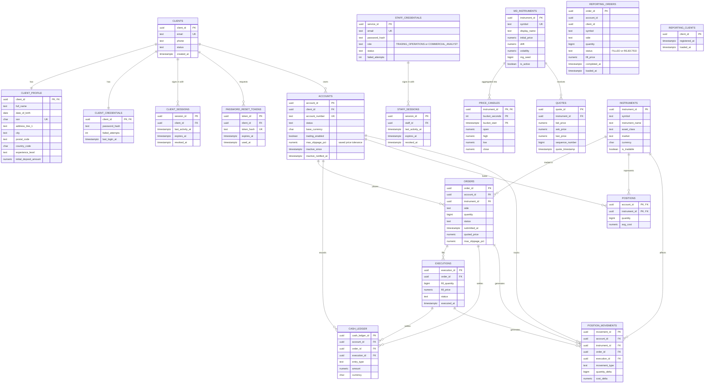

# leap-laugh-love

## Team Members
1. Software Developer - Chris Musselman
2. Scrum Master - Nikhil Akula
3. Software Developer - Yahia Elsaad
4. Software Developer - Lauren Sanday
5. Tech Lead - Elisa Paul

## Branching Strategy
We are using the Trunk branching strategy because it best fits our development strategy and schedule.

---

## [Documentation and Code Coverage](https://chrismuss04.github.io/leap-laugh-love/)

- **Javadoc API Reference**: [View Live Javadoc](https://chrismuss04.github.io/leap-laugh-love/javadoc/)
- **JaCoCo Test Coverage**: [View Live Coverage Hub](https://chrismuss04.github.io/leap-laugh-love/jacoco/)
  - [account-app](https://chrismuss04.github.io/leap-laugh-love/jacoco/account-app/)
  - [common-security](https://chrismuss04.github.io/leap-laugh-love/jacoco/common-security/)
  - [iam-app](https://chrismuss04.github.io/leap-laugh-love/jacoco/iam-app/)
  - [market-data-app](https://chrismuss04.github.io/leap-laugh-love/jacoco/market-data-app/)
  - [order-app](https://chrismuss04.github.io/leap-laugh-love/jacoco/order-app/)

---

## Architecture Overview

The repository is a **Multi-Module Maven Project** splitting identity and trading domains into independently deployable microservices along with a shared security library. Two non-Maven components complete the system: the Angular frontend and a Python reporting ETL. Docker Compose runs them together with PostgreSQL, Kafka and Mailpit:

1. **`common-security` (Shared Security Library)**: Contains reusable JWT token handling (`JwtService`, `JwtAuthenticationFilter`), the `Role` model (client, trading operations, commercial analyst), per-request session checks against the database (`ClientSessionValidator`), 401 JSON error formatting (`JwtAuthenticationEntryPoint`), and shared CORS configuration (`CommonCorsConfiguration`). Packaged as a standard library JAR.
2. **`iam-app` (Identity Access Management)**: Handles client registration, client and staff sign-in, JWT token issuance, login sessions (activity and logout), password reset by email, and the client profile and notification settings. On registration it opens the client's first account and funds it through `account-app`, and publishes a `client-register` event to Kafka. Runs on port `8081`.
3. **`account-app` (Account & Portfolio Services)**: Handles client accounts and trade settings, cash balances, deposits, withdrawals, transfers between accounts, portfolio holdings/positions, portfolio value history, and the internal validation and settlement endpoints that `order-app` calls. A nightly job flags inactive accounts and emails their clients. Runs on port `8082`.
4. **`order-app` (Order Management Services)**: Handles order creation, pre-trade validation against a fresh quote, execution processing, position movements audit trail, and order history. Background jobs finish interrupted fills and book the seeded order history, and every completed order is published to the `order-events` Kafka topic. Runs on port `8084`.
5. **`market-data-app` (Market Simulation)**: Simulates instrument prices with Geometric Brownian Motion (no external market-data API), keeping a live in-memory price per instrument, a validated quote (bid, ask, last) for each tick, and OHLC candle history with scheduled retention, exposed via REST and an SSE push stream. Runs on port `8083`.
6. **`frontend` (Angular UI)**: The client trading app and the staff `/reporting` area (see [Roles, Sessions and Staff Dashboards](#roles-sessions-and-staff-dashboards)). Served on port `4200`, with API calls proxied to the services.
7. **`reporting-etl` (Python ETL)**: Consumes the `order-events` and `client-register` Kafka topics and loads the `reporting.orders` and `reporting.clients` read models (see [Reporting ETL](#reporting-etl)). Runs as the `reporting-etl` and `user-etl` Compose services, with no port.


```mermaid
flowchart TB
    UI["Angular frontend (4200)<br/>client trading UI + staff /reporting"]

    subgraph PARENT["Parent Aggregator POM (leap-laugh-love-app)"]
        subgraph SEC["common-security (Shared Library)"]
            JwtS["JwtService, JwtAuthenticationFilter<br/>& ClientSessionValidator"]
            JwtEP["JwtAuthenticationEntryPoint"]
            CorsCfg["CommonCorsConfiguration"]
        end

        subgraph IAM["iam-app (Port 8081)"]
            IamApp["IamApplication @Import(JwtService)"]
            IamSec["IamSecurityConfig"]
            AuthC["AuthController<br/>/api/iam/auth/login"]
            PwC["PasswordResetController<br/>/api/iam/auth/*-password"]
            RegC["ClientRegistrationController<br/>/api/iam/v1/clients/register"]
            ProfC["ClientProfileController<br/>/api/iam/v1/clients/me"]
            SessC["ClientSessionController<br/>/api/iam/session"]
            AcctProv["AccountProvisioningListener<br/>(first account + deposit)"]
            RegPub["ClientRegistrationPublisher"]
            ResetMail["PasswordResetLinkListener"]
        end

        subgraph ACCOUNT["account-app (Port 8082)"]
            AccountApp["AccountApplication @Import(JwtService) @EnableScheduling"]
            AccountSec["AccountSecurityConfig (CORS Enabled)"]
            BalC["BalanceController<br/>/api/account/balance"]
            TransC["TransferController<br/>/api/account/balance/transfers"]
            AcctC["AccountController<br/>/api/account/accounts"]
            PosC["PositionController<br/>/api/account/accounts/{id}/positions"]
            PortC["PortfolioController<br/>/api/account/portfolio/history"]
            SettleC["AccountSettlementController<br/>/api/account/internal/accounts/{id}"]
            PHC["PriceHistoryClient<br/>(REST to market-data-app)"]
            InactDet["InactiveAccountDetector<br/>(nightly @Scheduled)"]
            InactNot["InactiveAccountNotifier"]
        end

        subgraph ORDER["order-app (Port 8084)"]
            OrderApp["OrderApplication @Import(JwtService)"]
            OrderSec["OrderSecurityConfig (CORS Enabled)"]
            OrderSubC["OrderSubmissionController<br/>/api/order/orders"]
            OrderHistC["OrderHistoryController<br/>/api/order/orders/history"]
            QuoteSvc["CurrentQuoteService<br/>(non-stale quote at execution)"]
            AcctClient["AccountClient<br/>(REST to account-app)"]
            FillRec["PendingFillRecovery &<br/>SeededFillService"]
            OrderEvPub["OrderEventPublisher"]
        end

        subgraph MARKETDATA["market-data-app (Port 8083)"]
            MdApp["MarketDataApplication @Import(JwtService) @EnableScheduling"]
            MdSec["MarketDataSecurityConfig (CORS Enabled)"]
            SimEngine["MarketSimulationEngine<br/>(GBM @Scheduled tick)"]
            QuoteIngest["QuoteIngestionService<br/>(tick -> validated quote)"]
            CandleAcc["PriceCandleAccumulator<br/>(ticks -> OHLC candles)"]
            PriceC["PriceController<br/>/api/marketdata/prices"]
            StreamC["PriceStreamController<br/>/api/marketdata/stream (SSE)"]
            QuoteC["QuoteController<br/>/api/marketdata/quotes"]
        end
    end

    subgraph PG["PostgreSQL"]
        IAM_DB[("iam schema")]
        TRADING_DB[("trading schema")]
        MARKETDATA_DB[("marketdata schema")]
        REPORTING_DB[("reporting schema")]
    end

    subgraph MSG["Messaging & mail"]
        KAFKA["Kafka<br/>order-events · client-register"]
        MAIL["Mailpit (SMTP, UI on 8025)"]
    end

    subgraph ETL["reporting-etl (Python)"]
        OrderEtl["reporting-etl<br/>order-events consumer"]
        UserEtl["user-etl<br/>client-register consumer"]
    end

    UI -->|"HTTP / JSON (8081)"| IamSec
    UI -->|"HTTP / JSON (8082)"| AccountSec
    UI -->|"HTTP / JSON (8084)"| OrderSec
    UI -->|"HTTP / JSON / SSE (8083)"| MdSec

    IamSec --> AuthC
    IamSec --> PwC
    IamSec --> RegC
    IamSec --> ProfC
    IamSec --> SessC
    RegC -->|"after commit"| AcctProv
    RegC -->|"after commit"| RegPub
    AcctProv -->|"HTTP / JSON (8082)<br/>create account, deposit"| AcctC
    PwC -->|"after commit"| ResetMail
    ResetMail -->|SMTP| MAIL
    RegPub -->|"client-register"| KAFKA

    AccountSec --> BalC
    AccountSec --> TransC
    AccountSec --> AcctC
    AccountSec --> PosC
    AccountSec --> PortC
    AccountSec --> SettleC
    PortC --> PHC
    PHC -->|"HTTP / JSON (8083)<br/>caller's JWT forwarded"| PriceC
    InactDet --> InactNot
    InactNot -->|SMTP| MAIL

    OrderSec --> OrderSubC
    OrderSec --> OrderHistC
    OrderSubC --> AcctClient
    FillRec --> AcctClient
    AcctClient -->|"HTTP / JSON (8082)<br/>pre-trade & settlement"| SettleC
    OrderSubC --> QuoteSvc
    QuoteSvc -->|"HTTP / JSON (8083)<br/>caller's JWT forwarded"| QuoteC
    OrderSubC --> OrderEvPub
    FillRec --> OrderEvPub
    OrderEvPub -->|"order-events"| KAFKA

    MdSec --> PriceC
    MdSec --> StreamC
    MdSec --> QuoteC
    SimEngine --> PriceC
    SimEngine --> StreamC
    SimEngine --> QuoteIngest
    SimEngine --> CandleAcc
    QuoteIngest --> QuoteC

    KAFKA --> OrderEtl
    KAFKA --> UserEtl
    OrderEtl --> REPORTING_DB
    UserEtl --> REPORTING_DB

    IamApp -. "Library Dependency" .-> JwtS
    AccountApp -. "Library Dependency" .-> JwtS
    OrderApp -. "Library Dependency" .-> JwtS
    MdApp -. "Library Dependency" .-> JwtS

    AuthC --> IAM_DB
    PwC --> IAM_DB
    RegC --> IAM_DB
    ProfC --> IAM_DB
    SessC --> IAM_DB
    JwtS -. "session lookup" .-> IAM_DB
    BalC --> TRADING_DB
    TransC --> TRADING_DB
    AcctC --> TRADING_DB
    PosC --> TRADING_DB
    PortC --> TRADING_DB
    SettleC --> TRADING_DB
    InactDet --> TRADING_DB
    OrderSubC --> TRADING_DB
    OrderHistC --> TRADING_DB
    FillRec --> TRADING_DB
    CandleAcc --> MARKETDATA_DB
    QuoteIngest --> MARKETDATA_DB
```

---

## UML Class Diagrams

Entities, repositories, services and controllers for each module (test sources, DTO getters and DTO records omitted for legibility). Microservices (`iam-app`, `account-app`, `order-app`, and `market-data-app`) share `JwtService`, `JwtAuthenticationFilter`, `JwtAuthenticationEntryPoint`, and `CommonCorsConfiguration` from the `common-security` module — those classes are marked `<<from common-security>>` where they appear. The Angular frontend and `reporting-etl` are not shown.

**Legend:** solid arrow (`-->`) = association / field reference · dashed arrow (`..>`) = dependency (calls / uses) · `<<interface>>` = Spring Data repository.

### Reactor overview


```mermaid
flowchart LR
    classDef mod fill:transparent,stroke-width:1.4px;
    CS["common-security<br/>(jwt · roles · sessions · cors)"]:::mod
    IAM["iam-app<br/>(clients · auth · sessions · password reset)"]:::mod
    MD["market-data-app<br/>(instruments · simulation · quotes · candles)"]:::mod
    ACCT["account-app<br/>(accounts · balance · positions · portfolio)"]:::mod
    ORD["order-app<br/>(orders · validation · executions · events)"]:::mod
    IAM -- "depends on" --> CS
    MD -- "depends on" --> CS
    ACCT -- "depends on" --> CS
    ORD -- "depends on" --> CS
    IAM -. "opens first account" .-> ACCT
    ORD -. "calls" .-> ACCT
    ORD -. "calls" .-> MD
    ACCT -. "calls" .-> MD
```

### Common Security — `common-security`

`com.leap.leaplaughlove.common.security` — lightweight shared security library providing JWT creation and validation, the role model, per-request login-session checks (client and staff sessions live in separate tables), request authentication filtering, entry point 401 error response handling, and centralized CORS configuration across all services.


```mermaid
classDiagram
    direction LR

    class Role {
        <<enumeration>>
        CLIENT
        TRADING_OPERATIONS
        COMMERCIAL_ANALYST
        +authority() String
        +isStaff() boolean
    }
    class JwtService {
        +generateToken(UUID, String, Role, UUID, Instant, Instant) String
        +generateSettlementToken(UUID) String
        +generateHistoryToken(UUID) String
        +parseIdentity(String) TokenIdentity
        +getExpirationSeconds() long
    }
    class TokenIdentity {
        <<record>>
        +UUID clientId
        +UUID sessionId
        +Instant expiresAt
        +String purpose
        +Role role
    }
    class ClientSessionValidator {
        +isActive(Role, UUID, UUID, Instant) boolean
    }
    class JwtAuthenticationFilter {
        +doFilterInternal(...)
    }
    class JwtAuthenticationEntryPoint {
        +commence(...)
    }
    class CommonCorsConfiguration {
        +applyDefaults(CorsConfiguration) CorsConfiguration$
    }
    class SecurityUtils {
        +getAuthenticatedClientId() UUID$
    }

    JwtService ..> Role : embeds
    JwtService ..> TokenIdentity : returns
    ClientSessionValidator ..> Role : selects session table
    JwtAuthenticationFilter --> JwtService : uses
    JwtAuthenticationFilter --> ClientSessionValidator : uses
```

### Identity & Access — `iam-app`

`com.leap.leaplaughlove.iam.{client, auth, session, staff, account, events, security, common}` — registers clients (`PB-02`), authenticates clients (BCrypt plus a failed-attempt lockout) and staff, mints the JWTs every other module verifies and records each login as a revocable session, sends password reset links by email, and on registration provisions the client's first account and announces the registration on Kafka.


```mermaid
classDiagram
    direction LR

    class Client {
        -UUID clientId
        -String email
        -String phone
        -String status
        -String fullName
        -LocalDate dateOfBirth
        -String ssn
        -String addressLine1
        -String city
        -String postalCode
        -String countryCode
        -String experienceLevel
        -BigDecimal initialDepositAmount
        -Boolean notifyOrderFills
        -Boolean notifyPriceAlerts
        +getStatus() String
        +setStatus(String)
    }
    class ClientCredentials {
        -UUID clientId
        -String passwordHash
        -int failedAttempts
        -OffsetDateTime lastLoginAt
        +incrementFailedAttempts()
        +resetFailedAttempts()
    }
    class ClientRepository {
        <<interface>>
        +findByEmail(String) Optional~Client~
        +existsByEmail(String) boolean
        +existsBySsn(String) boolean
    }
    class ClientCredentialsRepository {
        <<interface>>
        +findByClientId(UUID) Optional~ClientCredentials~
    }
    class StaffCredentialsRepository {
        +findByEmail(String) Optional~StaffCredentials~
        +recordFailedAttempt(UUID, int) int
        +recordSuccessfulLogin(UUID, Instant)
    }
    class ClientSessionRepository {
        +create(UUID, UUID, Instant, Instant)
        +recordActivity(UUID, UUID, Instant) boolean
        +revoke(UUID, UUID, Instant)
        +revokeAll(UUID, Instant)
    }
    class StaffSessionRepository {
        +create(UUID, UUID, Instant, Instant)
        +recordActivity(UUID, UUID, Instant) boolean
        +revoke(UUID, UUID, Instant)
    }
    class PasswordResetTokenRepository {
        +create(UUID, UUID, String, Instant, Instant)
        +isUsable(String, Instant) boolean
        +consume(String, Instant) Optional~UUID~
        +invalidateAll(UUID, Instant)
    }
    class ClientRegistrationController {
        +register(RegistrationRequest) RegistrationResponse
    }
    class ClientProfileController {
        +me() ClientProfileResponse
        +updateMe(UpdateSettingsRequest) ClientProfileResponse
    }
    class AuthController {
        +login(LoginRequest) LoginResponse
    }
    class AuthService {
        +authenticate(String, String) LoginResponse
    }
    class PasswordResetController {
        +forgotPassword(ForgotPasswordRequest)
        +validateResetToken(ResetTokenRequest)
        +resetPassword(ResetPasswordRequest)
    }
    class PasswordResetService {
        +requestReset(String)
        +validateToken(String)
        +resetPassword(String, String)
    }
    class PasswordResetLinkListener {
        +onPasswordResetRequested(PasswordResetRequestedEvent)
    }
    class ClientSessionController {
        +activity(Authentication)
        +logout(Authentication)
    }
    class AccountProvisioningListener {
        +onClientRegistered(ClientRegisteredEvent)
    }
    class AccountClient {
        +createAccount(String, String) UUID
        +deposit(String, UUID, BigDecimal, String)
    }
    class ClientRegistrationPublisher {
        +publish(ClientRegistrationEvent)
    }
    class JwtService { <<from common-security>> }
    class JwtAuthenticationFilter { <<from common-security>> }
    class IamSecurityConfig {
        +filterChain(...) SecurityFilterChain
    }
    class GlobalExceptionHandler {
        <<@RestControllerAdvice>>
    }
    class AccountLockedException
    class InvalidCredentialsException
    class InvalidResetTokenException
    class LoginRequest {
        <<record>>
        +String email
        +String password
    }
    class LoginResponse {
        <<record>>
        +String accessToken
        +String tokenType
        +long expiresInSeconds
        +Role role
    }

    Client "1" --> "1" ClientCredentials : secures
    ClientRepository ..> Client : manages
    ClientCredentialsRepository ..> ClientCredentials : manages
    ClientRegistrationController --> ClientRepository : uses
    ClientRegistrationController ..> Client : creates
    ClientRegistrationController ..> AccountProvisioningListener : publishes ClientRegisteredEvent
    ClientRegistrationController ..> ClientRegistrationPublisher : publishes ClientRegistrationEvent
    ClientProfileController --> ClientRepository : uses
    AccountProvisioningListener --> AccountClient : uses
    AccountProvisioningListener --> JwtService : mints token
    AuthController --> AuthService : uses
    AuthController ..> LoginRequest : accepts
    AuthController ..> LoginResponse : returns
    AuthService --> ClientRepository : uses
    AuthService --> ClientCredentialsRepository : uses
    AuthService --> StaffCredentialsRepository : staff sign-in
    AuthService --> ClientSessionRepository : creates session
    AuthService --> StaffSessionRepository : creates session
    AuthService --> JwtService : uses
    AuthService ..> AccountLockedException : throws
    AuthService ..> InvalidCredentialsException : throws
    ClientSessionController --> ClientSessionRepository : uses
    ClientSessionController --> StaffSessionRepository : uses
    PasswordResetController --> PasswordResetService : uses
    PasswordResetService --> ClientRepository : uses
    PasswordResetService --> ClientCredentialsRepository : uses
    PasswordResetService --> PasswordResetTokenRepository : uses
    PasswordResetService --> ClientSessionRepository : revokes sessions
    PasswordResetService ..> PasswordResetLinkListener : publishes PasswordResetRequestedEvent
    PasswordResetService ..> InvalidResetTokenException : throws
    JwtAuthenticationFilter --> JwtService : uses
    IamSecurityConfig ..> JwtAuthenticationFilter : registers
    GlobalExceptionHandler ..> AccountLockedException : handles
    GlobalExceptionHandler ..> InvalidCredentialsException : handles
    GlobalExceptionHandler ..> InvalidResetTokenException : handles
```

### Market Data — `market-data-app`

`com.leap.leaplaughlove.marketdata.{instrument, simulation, ingestion, history, stream, api}` — simulates prices with discretized Geometric Brownian Motion on a scheduler, publishes ticks as Spring events, turns each tick into a validated bid/ask/last quote, streams ticks over SSE, and rolls them up into OHLC candles at several widths. See [Price history and candle widths](#price-history-and-candle-widths) for how history is stored and generated.


```mermaid
classDiagram
    direction LR

    class SimulatedInstrument {
        -UUID instrumentId
        -String symbol
        -String displayName
        -BigDecimal initialPrice
        -BigDecimal drift
        -BigDecimal volatility
        -long rngSeed
        -boolean active
    }
    class PriceCandle {
        -UUID instrumentId
        -int bucketSeconds
        -OffsetDateTime bucketStart
        -BigDecimal open
        -BigDecimal high
        -BigDecimal low
        -BigDecimal close
    }
    class Quote {
        -UUID quoteId
        -BigDecimal bidPrice
        -long bidSize
        -BigDecimal askPrice
        -long askSize
        -BigDecimal lastPrice
        -long lastSize
        -String exchange
        -long sequenceNumber
        -OffsetDateTime quoteTimestamp
    }
    class SimulatedInstrumentRepository {
        <<interface>>
        +findByActiveTrue() List~SimulatedInstrument~
    }
    class PriceCandleRepository {
        <<interface>>
        +findByInstrument_SymbolAndBucketSecondsAndBucketStartBetween(...) Page~PriceCandle~
        +findFirstByInstrument_SymbolOrderByBucketStartDesc(...) Optional~PriceCandle~
        +existsByInstrument_InstrumentId(UUID) boolean
    }
    class QuoteRepository {
        <<interface>>
        +findFirstByInstrument_SymbolOrderByQuoteTimestampDesc(String) Optional~Quote~
    }
    class PriceHistoryBackfill {
        <<ApplicationRunner>>
        +run(ApplicationArguments)
    }
    class PriceCandleBulkWriter {
        +write(List~PriceCandle~)
    }
    class PriceCandleRetention {
        +prune()
    }
    class MarketSimulationEngine {
        +initialize()
        +tick()
        +latest(String) Optional~PriceState~
        +latestAll() List~PriceState~
    }
    class GbmPriceGenerator {
        <<utility>>
        +nextPrice(double, double, double, double, RandomGenerator)$ double
    }
    class PriceState {
        <<record>>
        +String symbol
        +BigDecimal price
        +OffsetDateTime asOf
    }
    class PriceTickEvent {
        <<record>>
        +PriceState priceState
    }
    class SimulatedQuoteFeedFormatter {
        +format(PriceState) String
    }
    class QuoteFeedMessageParser {
        <<utility>>
        +parse(String) QuoteFeedMessage$
    }
    class QuoteIngestionService {
        +onPriceTick(PriceTickEvent)
        +latest(String) Optional~QuoteState~
        +latestAll() List~QuoteState~
    }
    class PriceCandleAccumulator {
        +onPriceTick(PriceTickEvent)
        +flushStaleBuckets()
    }
    class PriceStreamBroadcaster {
        +subscribe(Set~String~) SseEmitter
        +onPriceTick(PriceTickEvent)
    }
    class PriceStreamController {
        +stream(String) SseEmitter
    }
    class PriceController {
        +getLatestPrices() List~PriceResponse~
        +getLatestPrice(String) PriceResponse
        +getHistory(...) Page~PriceCandleResponse~
    }
    class QuoteController {
        +getLatestQuotes() List~QuoteResponse~
        +getLatestQuote(String) QuoteResponse
    }
    class PriceResponse { <<record>> }
    class PriceCandleResponse { <<record>> }
    class QuoteResponse { <<record>> }
    class MarketDataSecurityConfig {
        +filterChain(...) SecurityFilterChain
    }
    class JwtService { <<from common-security>> }
    class JwtAuthenticationFilter { <<from common-security>> }
    class JwtAuthenticationEntryPoint { <<from common-security>> }

    PriceCandle "many" --> "1" SimulatedInstrument : instrument
    Quote "many" --> "1" SimulatedInstrument : instrument
    SimulatedInstrumentRepository ..> SimulatedInstrument : manages
    PriceCandleRepository ..> PriceCandle : manages
    QuoteRepository ..> Quote : manages
    MarketSimulationEngine --> SimulatedInstrumentRepository : uses
    MarketSimulationEngine --> PriceCandleRepository : resumes last close from
    PriceHistoryBackfill --> SimulatedInstrumentRepository : uses
    PriceHistoryBackfill --> PriceCandleRepository : checks
    PriceHistoryBackfill --> PriceCandleBulkWriter : seeds via
    PriceHistoryBackfill --> GbmPriceGenerator : uses
    PriceCandleRetention --> PriceCandleRepository : prunes
    MarketSimulationEngine --> GbmPriceGenerator : uses
    MarketSimulationEngine ..> PriceState : produces
    MarketSimulationEngine ..> PriceTickEvent : publishes
    QuoteIngestionService --> SimulatedInstrumentRepository : uses
    QuoteIngestionService --> QuoteRepository : stores
    QuoteIngestionService --> SimulatedQuoteFeedFormatter : formats tick
    QuoteIngestionService --> QuoteFeedMessageParser : parses and validates
    QuoteIngestionService ..> PriceTickEvent : listens
    PriceCandleAccumulator --> SimulatedInstrumentRepository : uses
    PriceCandleAccumulator --> PriceCandleRepository : uses
    PriceCandleAccumulator ..> PriceTickEvent : listens
    PriceCandleAccumulator ..> PriceCandle : creates
    PriceStreamBroadcaster ..> PriceTickEvent : listens
    PriceStreamController --> PriceStreamBroadcaster : uses
    PriceController --> MarketSimulationEngine : uses
    PriceController --> PriceCandleRepository : uses
    PriceController ..> PriceResponse : returns
    PriceController ..> PriceCandleResponse : returns
    QuoteController --> QuoteIngestionService : uses
    QuoteController ..> QuoteResponse : returns
    MarketDataSecurityConfig ..> JwtService : uses
    MarketDataSecurityConfig ..> JwtAuthenticationFilter : registers
    MarketDataSecurityConfig ..> JwtAuthenticationEntryPoint : registers
```

### Account & Portfolio — `account-app`

`com.leap.leaplaughlove.account.{account, balance, ledger, position, portfolio, settlement, inactivity, client, instrument, quote, security}` — owns client trading accounts and their trade settings, cash ledger entries, deposit/withdrawal/transfer transactions, portfolio positions and value history (`ClientStatus` is a read-only view of `iam.clients`), the nightly inactive-account check and email, and the internal pre-trade validation/settlement endpoints; public endpoints resolve the client from the JWT principal.


```mermaid
classDiagram
    direction LR

    class Account {
        -UUID accountId
        -UUID clientId
        -String accountNumber
        -String status
        -String baseCurrency
        -boolean tradingEnabled
        -BigDecimal maxSlippagePercent
        -OffsetDateTime createdAt
        -OffsetDateTime inactiveSince
        -OffsetDateTime inactiveNotifiedAt
    }
    class CashLedgerEntry {
        -UUID cashLedgerId
        -UUID accountId
        -UUID orderId
        -UUID executionId
        -String entryType
        -BigDecimal amount
        -String currency
        -OffsetDateTime createdAt
        -String description
    }
    class Position {
        -UUID accountId
        -UUID instrumentId
        -long quantity
        -BigDecimal avgCost
        -OffsetDateTime updatedAt
    }
    class PositionId {
        <<composite key>>
        -UUID accountId
        -UUID instrumentId
    }
    class PositionMovement {
        -UUID movementId
        -UUID accountId
        -UUID instrumentId
        -UUID orderId
        -UUID executionId
        -String movementType
        -long quantityDelta
        -BigDecimal costDelta
    }
    class Instrument {
        -UUID instrumentId
        -String symbol
        -String instrumentName
        -String assetClass
    }
    class ClientStatus {
        <<read-only view>>
        -UUID clientId
        -String status
        -String email
    }
    class AccountRepository {
        <<interface>>
        +findByClientIdAndStatus(UUID, String) List~Account~
        +findByAccountIdAndClientId(UUID, UUID) Optional~Account~
        +findByInactiveSinceIsNotNullAndInactiveNotifiedAtIsNull() List~Account~
    }
    class CashLedgerRepository {
        <<interface>>
        +sumAmountsByAccountIds(List~UUID~) List~AccountTotal~
        +sumAmountByAccountIdAndCurrency(UUID, String) BigDecimal
    }
    class PositionRepository {
        <<interface>>
        +findPositionsByAccountId(UUID) List~PositionRow~
    }
    class PositionMovementRepository {
        <<interface>>
        +findByAccountIdAndInstrumentId(UUID, UUID) List~PositionMovement~
    }
    class InstrumentRepository {
        <<interface>>
    }
    class ClientStatusRepository {
        <<interface>>
    }
    class AccountAuthorizationService {
        +getAuthorizedAccount(UUID) Account
        +getAuthorizedTradingAccountForUpdate(UUID) Account
    }
    class AccountService {
        +createAccount(CreateAccountRequest) Account
        +updateTradeSettings(UUID, TradeSettingsRequest) Account
    }
    class AccountController {
        +createAccount(CreateAccountRequest) AccountSummary
        +getAccountsForClient() List~AccountSummary~
        +getAccount(UUID) AccountSummary
        +updateTradeSettings(UUID, TradeSettingsRequest) AccountSummary
    }
    class BalanceService {
        +getBalanceForClient() BalanceResponse
        +deposit(UUID, CashMovementRequest) CashTransactionResponse
        +withdraw(UUID, CashMovementRequest) CashTransactionResponse
    }
    class BalanceController {
        +getBalance() BalanceResponse
        +deposit(UUID, CashMovementRequest) CashTransactionResponse
        +withdraw(UUID, CashMovementRequest) CashTransactionResponse
    }
    class TransferService {
        +transfer(CashTransferRequest) CashTransferResponse
    }
    class TransferController {
        +transfer(CashTransferRequest) CashTransferResponse
    }
    class PositionService {
        +getPositionsForAuthenticatedClientAccount(UUID) PositionsResponse
    }
    class PositionController {
        +getPositionsForAccount(UUID) PositionsResponse
    }
    class PortfolioHistoryService {
        +getHistory(PortfolioRange) PortfolioHistoryResponse
    }
    class PortfolioController {
        +getHistory(String) PortfolioHistoryResponse
    }
    class PriceHistoryClient {
        +fetchCloses(String, OffsetDateTime, OffsetDateTime, int) List~CandleClose~
        +fetchLatestPrice(String) Optional~BigDecimal~
    }
    class AccountSettlementService {
        +getValidationData(UUID, UUID) AccountValidationDto
        +settleOrder(UUID, SettlementRequest) SettlementResponse
    }
    class AccountSettlementController {
        +getValidationData(UUID, UUID) AccountValidationDto
        +settle(UUID, SettlementRequest) SettlementResponse
    }
    class InactiveAccountDetector {
        +detect()
    }
    class InactiveAccountNotifier {
        +onInactivityChecked(InactivityCheckedEvent)
        +notifyClients() int
    }
    class AccountSecurityConfig {
        +filterChain(...) SecurityFilterChain
    }
    class JwtService { <<from common-security>> }
    class JwtAuthenticationFilter { <<from common-security>> }
    class JwtAuthenticationEntryPoint { <<from common-security>> }

    Account "1" --> "many" CashLedgerEntry : ledger
    Position ..> PositionId : identified by
    AccountRepository ..> Account : manages
    CashLedgerRepository ..> CashLedgerEntry : manages
    PositionRepository ..> Position : manages
    PositionMovementRepository ..> PositionMovement : manages
    InstrumentRepository ..> Instrument : manages
    ClientStatusRepository ..> ClientStatus : reads
    AccountAuthorizationService --> AccountRepository : uses
    AccountService --> AccountRepository : uses
    AccountService --> ClientStatusRepository : uses
    AccountService --> AccountAuthorizationService : uses
    AccountController --> AccountService : uses
    AccountController --> AccountAuthorizationService : uses
    AccountController --> AccountRepository : uses
    BalanceService --> AccountRepository : uses
    BalanceService --> CashLedgerRepository : uses
    BalanceService --> AccountAuthorizationService : uses
    BalanceController --> BalanceService : uses
    TransferService --> AccountAuthorizationService : uses
    TransferService --> CashLedgerRepository : uses
    TransferService --> BalanceService : uses
    TransferController --> TransferService : uses
    PositionService --> AccountRepository : uses
    PositionService --> PositionRepository : uses
    PositionController --> PositionService : uses
    PortfolioHistoryService --> AccountRepository : uses
    PortfolioHistoryService --> PositionRepository : uses
    PortfolioHistoryService --> PositionMovementRepository : uses
    PortfolioHistoryService --> CashLedgerRepository : uses
    PortfolioHistoryService --> PriceHistoryClient : prices history
    PortfolioController --> PortfolioHistoryService : uses
    AccountSettlementService --> AccountAuthorizationService : uses
    AccountSettlementService --> BalanceService : uses
    AccountSettlementService --> CashLedgerRepository : uses
    AccountSettlementService --> PositionRepository : uses
    AccountSettlementController --> AccountSettlementService : uses
    InactiveAccountDetector --> AccountRepository : flags
    InactiveAccountDetector ..> InactiveAccountNotifier : InactivityCheckedEvent
    InactiveAccountNotifier --> AccountRepository : uses
    InactiveAccountNotifier --> ClientStatusRepository : uses
    AccountSecurityConfig ..> JwtService : uses
    AccountSecurityConfig ..> JwtAuthenticationFilter : registers
    AccountSecurityConfig ..> JwtAuthenticationEntryPoint : registers
```

### Order Management — `order-app`

`com.leap.leaplaughlove.order.{order, execution, submission, history, validation, instrument, position, account, client, quote, events, security}` — handles pre-trade validation, order submission, execution against live market quotes, position movements audit logging, and paginated order history; coordinates with `account-app` via internal REST client and `market-data-app` for quotes. Background jobs complete interrupted fills and book the seeded order history, and every finished order is published to Kafka for reporting.


```mermaid
classDiagram
    direction LR

    class Order {
        -UUID orderId
        -UUID accountId
        -String accountNumber
        -Instrument instrument
        -Side side
        -Long quantity
        -Status status
        -OffsetDateTime submittedAt
        -OffsetDateTime acceptedAt
        -OffsetDateTime rejectedAt
        -OffsetDateTime filledAt
        -String rejectionReason
        -BigDecimal quotedPrice
        -BigDecimal maxSlippagePercent
    }
    class Side { <<enumeration>> BUY SELL }
    class Status { <<enumeration>> SUBMITTED ACCEPTED REJECTED FILLED }
    class Execution {
        -UUID executionId
        -Order order
        -Long fillQuantity
        -BigDecimal fillPrice
        -Status status
        -OffsetDateTime executedAt
        -String reason
    }
    class PositionMovement {
        -UUID movementId
        -UUID accountId
        -Instrument instrument
        -UUID orderId
        -UUID executionId
        -MovementType movementType
        -Long quantityDelta
        -BigDecimal costDelta
        -OffsetDateTime createdAt
    }
    class Instrument {
        -UUID instrumentId
        -String symbol
        -String instrumentName
        -String assetClass
        -String market
        -String currency
        -boolean tradable
    }
    class OrderRepository {
        <<interface>>
        +findByAccountIdInOrderBySubmittedAtDescOrderIdDesc(Collection~UUID~, Pageable) Page~Order~
    }
    class ExecutionRepository {
        <<interface>>
        +findByOrder_OrderIdIn(Collection~UUID~) List~Execution~
    }
    class PositionMovementRepository {
        <<interface>>
    }
    class InstrumentRepository {
        <<interface>>
        +findBySymbol(String) Optional~Instrument~
    }
    class AccountRepository {
        <<interface>>
    }
    class OrderSubmissionService {
        +submitOrder(OrderSubmissionRequest) OrderSubmissionResponse
    }
    class OrderSubmissionController {
        +submitOrder(OrderSubmissionRequest) OrderSubmissionResponse
    }
    class FillRecorder {
        +recordExecution(Order, BigDecimal, OffsetDateTime) Execution
        +settle(Order, Execution, String) SettlementResponse
        +completeFill(Order, Execution) boolean
    }
    class PendingFillRecovery {
        +run()
    }
    class SeededFillService {
        +start()
    }
    class OrderHistoryService {
        +getOrderHistory(UUID, int, int, Integer, Integer, Integer) Page~OrderHistoryItem~
    }
    class OrderHistoryController {
        +getOrderHistory(int, int, Integer, Integer, Integer) Page~OrderHistoryItem~
    }
    class TradeValidationService {
        +validateTrade(AccountValidationDto, Instrument, ...) TradeValidationResult
        +checkPriceTolerance(BigDecimal, BigDecimal, ...) TradeValidationResult
    }
    class AccountClient {
        +getValidationData(UUID, UUID) AccountValidationDto
        +settleOrder(UUID, SettlementRequest) SettlementResponse
        +settleOrderAs(UUID, SettlementRequest, String) SettlementResponse
        +getAccountIdsForClient() List~UUID~
    }
    class CurrentQuoteService {
        +getCurrentQuote(String) QuoteSnapshot
    }
    class CurrentQuoteClient {
        +fetchLatest(String) Optional~QuoteSnapshot~
    }
    class PriceHistoryClient {
        +fetchCloses(String, OffsetDateTime, OffsetDateTime, int) List~CandleClose~
        +fetchLatestPrice(String) Optional~BigDecimal~
    }
    class OrderEventPublisher {
        +publishFilled(Order, Execution)
        +publishRejected(Order)
    }
    class OrderCompletedEvent {
        <<record>>
    }
    class OrderSecurityConfig {
        +filterChain(...) SecurityFilterChain
    }
    class JwtService { <<from common-security>> }
    class JwtAuthenticationFilter { <<from common-security>> }
    class JwtAuthenticationEntryPoint { <<from common-security>> }

    Order --> Instrument : instrument
    Order --> Side
    Order --> Status
    Execution --> Order : order
    PositionMovement --> Instrument : instrument
    OrderRepository ..> Order : manages
    ExecutionRepository ..> Execution : manages
    PositionMovementRepository ..> PositionMovement : manages
    InstrumentRepository ..> Instrument : manages
    OrderSubmissionService --> OrderRepository : uses
    OrderSubmissionService --> ExecutionRepository : uses
    OrderSubmissionService --> InstrumentRepository : uses
    OrderSubmissionService --> AccountClient : uses
    OrderSubmissionService --> CurrentQuoteService : uses
    OrderSubmissionService --> TradeValidationService : uses
    OrderSubmissionService --> FillRecorder : uses
    OrderSubmissionService --> OrderEventPublisher : uses
    OrderSubmissionController --> OrderSubmissionService : uses
    FillRecorder --> ExecutionRepository : uses
    FillRecorder --> PositionMovementRepository : uses
    FillRecorder --> AccountClient : settles via
    PendingFillRecovery --> OrderRepository : finds stuck orders
    PendingFillRecovery --> AccountRepository : uses
    PendingFillRecovery --> FillRecorder : uses
    PendingFillRecovery --> OrderEventPublisher : uses
    PendingFillRecovery --> JwtService : mints settlement token
    SeededFillService --> OrderRepository : uses
    SeededFillService --> FillRecorder : uses
    SeededFillService --> PriceHistoryClient : prices at fill time
    SeededFillService --> OrderEventPublisher : uses
    SeededFillService --> JwtService : mints settlement and history tokens
    OrderEventPublisher --> AccountRepository : resolves client
    OrderEventPublisher ..> OrderCompletedEvent : sends to Kafka
    OrderHistoryService --> OrderRepository : uses
    OrderHistoryService --> ExecutionRepository : uses
    OrderHistoryService --> AccountClient : uses
    OrderHistoryController --> OrderHistoryService : uses
    CurrentQuoteService --> CurrentQuoteClient : uses
    OrderSecurityConfig ..> JwtService : uses
    OrderSecurityConfig ..> JwtAuthenticationFilter : registers
    OrderSecurityConfig ..> JwtAuthenticationEntryPoint : registers
```

---

## API Endpoints Summary

Access is role-based. The JWT carries the caller's role (`CLIENT`, `TRADING_OPERATIONS` or `COMMERCIAL_ANALYST`),
and every protected endpoint below requires `CLIENT` unless the Auth column says otherwise. The internal
`SERVICE` role is what one backend uses when it calls another on its own behalf; it is not issued to users.

| Module | Endpoint | Description | Permitted / Auth |
|---|---|---|---|
| **IAM** | `POST /api/iam/auth/login` | Sign in as a client or as staff (trading operations, commercial analyst); returns a JWT carrying the role | Permitted |
| **IAM** | `POST /api/iam/v1/clients/register` | Client registration | Permitted |
| **IAM** | `POST /api/iam/auth/forgot-password` | Request a password reset link; always `204`, whether or not the email is registered | Permitted |
| **IAM** | `POST /api/iam/auth/reset-password/validate` | Check that a reset link's token is still usable, without spending it; `400 INVALID_RESET_TOKEN` if not | Permitted |
| **IAM** | `POST /api/iam/auth/reset-password` | Set a new password with the token from the reset link; `400 INVALID_RESET_TOKEN` if it is unknown, expired or used | Permitted |
| **IAM** | `GET /api/iam/v1/clients/me` | Get the signed-in client's profile and notification preferences | Bearer JWT (client) |
| **IAM** | `PUT /api/iam/v1/clients/me` | Update the signed-in client's profile and notification preferences | Bearer JWT (client) |
| **IAM** | `POST /api/iam/session/activity` | Record user activity, keeping the session from timing out as idle | Bearer JWT (client or staff) |
| **IAM** | `POST /api/iam/session/logout` | End the session; its token stops working immediately | Bearer JWT (client or staff) |
| **IAM** | `GET /actuator/health` | IAM service health check | Permitted |
| **Account** | `GET /api/account/accounts` | Get client trading accounts | Bearer JWT (client) |
| **Account** | `POST /api/account/accounts` | Open an additional trading account | Bearer JWT (client) |
| **Account** | `GET /api/account/accounts/{id}` | Get specific trading account | Bearer JWT (client) |
| **Account** | `PUT /api/account/accounts/{id}/trade-settings` | Save the account's price tolerance (`max_slippage_pct`) | Bearer JWT (client) |
| **Account** | `GET /api/account/accounts/{id}/positions` | Get holdings/positions for account | Bearer JWT (client) |
| **Account** | `GET /api/account/balance` | Get balances for authenticated client | Bearer JWT (client) |
| **Account** | `POST /api/account/balance/accounts/{id}/deposit` | Deposit funds | Bearer JWT (client) |
| **Account** | `POST /api/account/balance/accounts/{id}/withdrawal` | Withdraw funds | Bearer JWT (client) |
| **Account** | `POST /api/account/balance/transfers` | Transfer cash between the client's own accounts | Bearer JWT (client) |
| **Account** | `GET /api/account/portfolio/history` | Portfolio value over time; `range` selects the period (default `1M`) | Bearer JWT (client) |
| **Account** | `GET /api/account/internal/accounts/{id}/validation-data` | Pre-trade validation data (account status, cash balance, holding in the instrument, saved price tolerance) for order-app | Bearer JWT (client or service) |
| **Account** | `POST /api/account/internal/accounts/{id}/settlement` | Settle a filled order against cash and positions; called by order-app | Bearer JWT (client or service) |
| **Account** | `GET /actuator/health` | Account service health check | Permitted |
| **Order** | `POST /api/order/orders` | Place order (BUY/SELL) with immediate execution | Bearer JWT (client) |
| **Order** | `GET /api/order/orders/history` | Paginated order history (`page`, `size`); optional `year`, `month` and `day` narrow it to a date | Bearer JWT (client) |
| **Order** | `GET /actuator/health` | Order service health check | Permitted |
| **Market Data** | `GET /api/marketdata/prices` | Latest simulated price for every active instrument (503 S&P 500 constituents plus the index/benchmark symbols) | Bearer JWT (client) |
| **Market Data** | `GET /api/marketdata/prices/{symbol}` | Latest simulated price for one instrument | Bearer JWT (client) |
| **Market Data** | `GET /api/marketdata/prices/{symbol}/history` | Paginated OHLC candle history; `interval` selects the candle width in seconds (`60`, `300`, `3600`, `86400`, default `60`) | Bearer JWT (client or service) |
| **Market Data** | `GET /api/marketdata/quotes` | Latest ingested quote (bid, ask, last, sizes) for every instrument | Bearer JWT (client) |
| **Market Data** | `GET /api/marketdata/quotes/{symbol}` | Latest ingested quote for one instrument; order-app uses it to price and stale-check orders | Bearer JWT (client) |
| **Market Data** | `GET /api/marketdata/stream` | Server-Sent-Events push of live price ticks (optional `?symbols=` filter) | Bearer JWT (client) |
| **Market Data** | `GET /actuator/health` | Market data service health check | Permitted |

---

## Roles, Sessions and Staff Dashboards

### Roles

Everyone signs in through the same endpoint, `POST /api/iam/auth/login`. IAM looks the email up
among clients first and, if it is not a client's, among staff (`iam.reporting_service_credentials`).
The response carries a JWT whose `role` claim is one of:

| Role | Who | Home page | Backend access |
| --- | --- | --- | --- |
| `CLIENT` | Registered traders | `/dashboard` | All client-facing trading APIs |
| `TRADING_OPERATIONS` | Staff auditing orders | `/reporting` | None of the trading APIs (see below) |
| `COMMERCIAL_ANALYST` | Staff reporting on business activity | `/reporting` | None of the trading APIs (see below) |

Every backend service (`account-app`, `order-app`, `market-data-app`, and IAM's own client
endpoints) requires `CLIENT`, so a staff token is refused there. Staff accounts are not created
through the app; the two seeded ones are listed in [Quick Start](#quick-start). Separately,
order-app's background jobs (`PendingFillRecovery` and `SeededFillService`) mint short-lived,
purpose-scoped service tokens to act for a client with no browser session. Each works on one
endpoint only (account settlement, or a symbol's price history) and carries the `SERVICE` authority.

Failed sign-ins are counted per account for clients and staff alike. After 3 the account is
`LOCKED` and sign-in returns an account-locked error.

### Sessions

Each sign-in creates a row in `iam.client_sessions` or `iam.staff_sessions` and embeds its id (the
`sid` claim) in the JWT. The raw token is never stored. `common-security` checks the session on every
request, in the table matching the token's role, and rejects the token when the session is:

- **revoked**, which `POST /api/iam/session/logout` does immediately;
- **past its absolute expiry**, which is the JWT lifetime (`app.jwt.expiration-minutes`, 60 by default);
- **idle for more than 10 minutes**. The frontend reports user activity to
  `POST /api/iam/session/activity` to keep the session alive, and signs the user out when either limit passes.

### Staff dashboards

The Angular app serves staff from `/reporting`, a separate shell from the trading UI because a staff
token cannot read the client profile or live prices the trading shell loads. Routing sends each role
to its own dashboard, and a client who opens `/reporting` is redirected home.

| Role | Route | Page |
| --- | --- | --- |
| `TRADING_OPERATIONS` | `/reporting` | **Order Audit**: orders submitted, filled, rejected and awaiting execution, with audit filters |
| `TRADING_OPERATIONS` | `/reporting/orders/:orderId` | **Order lifecycle**: one order retraced through its executions and the cash and holdings ledgers |
| `COMMERCIAL_ANALYST` | `/reporting` | **Trading Activity**: trading volume, average order value, new registrations and active clients over a period (1W, 1M, 3M, YTD, 1Y or custom) |

> [!NOTE]
> The dashboards are built, routed, filtered and tested, but the report panels are still
> placeholders: no reporting API exists yet, so the pages show the layout and filters without data.
> The data they will read is being collected in the `reporting.orders` and `reporting.clients`
> tables by the ETL services described under [Reporting ETL](#reporting-etl).

---

## Building and Running

### Quick Start

The database, Kafka, Mailpit, all four backend services, the reporting ETL and the Angular UI, in two commands. Docker is the only
prerequisite - you do not need Node, Java or Maven installed to run the stack.

```bash
cp .env.example .env
docker compose up --build
```

Then open **http://localhost:4200** and sign in with a seeded account:

| Email | Password | Role |
| --- | --- | --- |
| `alice.johnson@leap.com` | `Password123!` | Client - lands on the trading dashboard |
| `trading.ops@leap.com` | `Password123!` | Staff, trading operations - lands on `/reporting` |
| `commercial.analyst@leap.com` | `Password123!` | Staff, commercial analyst - lands on `/reporting` |

Emails the services send (password reset, inactive account) are caught by Mailpit at
**http://localhost:8025**; nothing reaches a real inbox.

A signed-in session times out after 10 minutes without activity, for clients and staff alike.

The first run builds the service images and installs the frontend dependencies, so expect a
few minutes; later runs start in seconds. Frontend edits hot-reload. Backend edits need
`docker compose up --build` to rebuild the image.

Stop with `docker compose down`, or `docker compose down -v` to also drop the database and
force a fresh frontend dependency install next time.

> [!NOTE]
> `.env.example` carries working local-dev defaults, including a placeholder `JWT_SECRET`.
> They are not secrets and are not suitable for any shared or deployed environment.

### 1. Build and Run Tests (Maven)

Build all modules and execute the full test suite from the repository root:

```bash
mvn clean verify
```

To build or test individual modules:

> **Run every command below from the repository root** (the folder containing the parent
> `pom.xml`), never from inside a service folder such as `order-app/`. The services depend on
> `common-security`, which is not published to Maven Central. A root-level build with `-am`
> (also-make) compiles `common-security` first and puts it on the service's classpath. Running
> `mvn` inside `order-app/` fails with *"Could not resolve dependencies ...
> common-security:jar:0.1.0"*.

```bash
# Test Common Security module
mvn -pl common-security test

# Test IAM module (with dependency building)
mvn -pl iam-app -am test

# Test Account module (with dependency building)
mvn -pl account-app -am test

# Test Order module (with dependency building)
mvn -pl order-app -am test

# Test Market Data module (with dependency building)
mvn -pl market-data-app -am test
```

### End-to-end tests (Playwright)

`e2e/` holds a small suite of browser and API tests for the critical paths (sign-in,
registration, trading, order history, holdings) that run against the whole stack. Start the
stack with the E2E overlay, which adds the suite's test users, then run them:

```bash
docker compose -f docker-compose.yml -f docker-compose.e2e.yml up -d --build
cd e2e && npm install && npx playwright install chromium
npm test            # or: npm run test:smoke, npm run test:ui
```

See [e2e/README.md](e2e/README.md) for running without Docker, how tests stay isolated, and
conventions for writing new ones.

### Frontend unit tests

```bash
cd frontend
npx ng test --watch=false --coverage
```

The specs run on Vitest in headless Chromium through Playwright. The first time, download that
browser with `npx playwright install chromium` (from `frontend/`). Coverage is written to
`frontend/coverage/leap-laugh-love-frontend/` (an HTML report plus `lcov.info` for SonarQube).

### Continuous integration (Jenkins)

The [Jenkinsfile](Jenkinsfile) runs these stages on every push:

| Stage | What it does |
| --- | --- |
| Checkout, Configure Pipeline, Pull Images, Start Database | Set up the workspace, decide which optional stages run, and start the database |
| Build and Test → Frontend | Install dependencies, build the Angular app and run its unit tests (Vitest, with coverage) |
| Build and Test → Unit Tests | `mvn test` across all modules (JaCoCo coverage) and the `reporting-etl` pytest suite |
| Build and Test → Service Stack | Build the Docker images, validate the database schema and seeds, start the services and check their health |
| Verify → Static Analysis | SonarQube analysis and Quality Gate (see below) |
| Verify → Stack Tests | Playwright **E2E** tests, then the **Trade Recovery Tests** (`scripts/test-trade-recovery.sh`; background in [docs/trade-record-resilience.md](docs/trade-record-resilience.md)) |

`main` and pull requests run the whole pipeline. Feature-branch pushes skip E2E, the recovery
tests and SonarQube.

### SonarQube

Jenkins analyses `main` and pull requests into the SonarQube project `leap-laugh-love-app` and
stops the build if the classroom Quality Gate fails. Feature-branch pushes skip it: Community
Build keeps a single analysis per project, so a branch scan would overwrite `main`'s. The
analysis settings live in [sonar-project.properties](sonar-project.properties); the token is the
Jenkins credential `sonarqube-token` and is never committed.

One-time setup:

- **SonarQube**: create the project `leap-laugh-love-app`. Under *Quality Profiles → Restore*,
  import the classroom profiles for Java, TypeScript (`texoma-typescript-profile.xml`),
  JavaScript, HTML, CSS and Docker and assign them to the project, along with the classroom
  Quality Gate. Add a webhook named `Jenkins` pointing at
  `http://host.docker.internal:8080/sonarqube-webhook/`, otherwise the Quality Gate stage
  waits until it times out.
- **Jenkins**: install the *SonarQube Scanner* plugin; add the project token as a *Secret text*
  credential with ID `sonarqube-token`; under *Manage Jenkins → System* add a SonarQube server
  named `SonarQube` using that credential; under *Manage Jenkins → Tools* add a SonarQube
  Scanner installation named `SonarScanner`.

To analyse a local checkout, run the tests first so the coverage reports exist, then the scanner
(it needs Node on the PATH for the TypeScript analysis):

```bash
mvn test
(cd frontend && npx ng test --watch=false --coverage)
sonar-scanner -Dsonar.host.url=http://localhost:9000 -Dsonar.token=<your token>
```

### Migrating an existing database

Schema and seed files only run on an empty database, so after pulling changes to the schema either
run `docker compose down -v` (drops all data) or apply the matching additive migration from the
repository root. Each script is safe to rerun and keeps existing data:

```bash
docker compose exec -T db psql -U paysprint -d paysprint -v ON_ERROR_STOP=1 < scripts/<migration>.sql
```

| Script | Adds |
| --- | --- |
| `migrate-client-sessions.sql` | `iam.client_sessions` (session timeout and revocation) |
| `migrate-staff-sessions.sql` | `iam.staff_sessions` for trading operations and analyst sign-in |
| `migrate-password-reset-tokens.sql` | `iam.password_reset_tokens` (password reset links) |
| `migrate-notification-preferences.sql` | Client notification preferences (`notify_order_fills`, `notify_price_alerts`) |
| `migrate-price-tolerance.sql` | Saved `max_slippage_pct` on accounts and the quoted price and tolerance on orders |
| `migrate-inactive-accounts.sql` | `trading.accounts.inactive_since` |
| `migrate-inactive-notification.sql` | `trading.accounts.inactive_notified_at` |
| `migrate-reporting-clients.sql` | `reporting.clients` (see *Reporting ETL*) |
| `migrate-price-candles-key.sql` | Moves `marketdata.price_candles` to its natural primary key; stop market-data-app first |

`reporting.orders` has no migration script; it needs `docker compose down -v` once (see *Reporting ETL*).

### 2. Documentation and Code Coverage Generation

The live documentation site is hosted on GitHub Pages from the [`gh-pages`](https://github.com/chrismuss04/leap-laugh-love/tree/gh-pages) branch at [https://chrismuss04.github.io/leap-laugh-love/](https://chrismuss04.github.io/leap-laugh-love/).

#### Normal Development (Default)
During regular local development on `main` or feature branches:
```bash
mvn test
```
JaCoCo coverage reports output to `target/site/jacoco` (which is gitignored), and Javadoc generation is skipped entirely. The root `docs/` folder is **not** touched or generated, ensuring your git working tree stays clean. To generate Javadoc during development:

```bash
mvn compile javadoc:javadoc
```

#### Generating `docs/` for the `gh-pages` Branch
To update the live GitHub Pages documentation hosted on the `gh-pages` branch:

1. **Switch to or prepare your `gh-pages` branch**:
   ```bash
   git switch gh-pages
   git merge main # or rebase onto main
   ```

2. **Generate the documentation and coverage reports into `docs/`**:
   Activate the `docs` Maven profile using `-Pdocs`:
   ```bash
   mvn clean test prepare-package -Pdocs
   ```
   This command:
   - Executes all unit tests and generates per-module JaCoCo coverage reports directly into `docs/jacoco/<module-name>/`.
   - Generates the aggregate Javadoc API documentation directly into `docs/javadoc/`.

3. **Commit and push to `gh-pages`**:
   ```bash
   git add docs/
   git commit -m "docs: update javadoc and jacoco coverage reports"
   git push origin gh-pages
   ```

> [!NOTE]
> In a multi-module Maven project where `iam-app`, `account-app`, `order-app`, and `market-data-app` depend on the sibling library module `common-security`, invoking `compile` prior to `javadoc:javadoc` (or ensuring artifacts are installed in the local repository) ensures that class files for dependencies in the reactor are built so the Javadoc compiler can resolve classpath types across modules.
> 
> To generate standalone Javadocs for a single module during development:
> ```bash
> mvn compile javadoc:javadoc -pl iam-app -am
> ```

### 3. Launch Services via Docker Compose (Recommended)

Compose reads configuration from `.env` (copy it from `.env.example` once). To launch every
container — `db`, `iam-app`, `account-app`, `order-app`, `market-data-app` and `frontend`:

```bash
docker compose up -d --build
```

Override any value by editing `.env`, or per-invocation:

```bash
JWT_SECRET="your_jwt_secret_key_here_minimum_32_chars" docker compose up -d --build
```

Services will be exposed on:
- **Frontend (Angular dev server)**: `http://localhost:4200`
- **IAM Application**: `http://localhost:8081`
- **Account Application**: `http://localhost:8082`
- **Order Application**: `http://localhost:8084`
- **Market Data Application**: `http://localhost:8083`
- **PostgreSQL Database**: `localhost:5432`

The dev server proxies API calls to backend services per `frontend/proxy.conf.js`.

**Kafka** (`kafka`, single-node KRaft) is reachable only on the compose network, at
`kafka:9092`; no host port is published. The one-shot `kafka-init` service creates the
`order-events` and `client-register` topics (3 partitions each) on startup - add further topics to its command in
`docker-compose.yml`. To inspect it from the host:

```bash
docker compose exec kafka /opt/kafka/bin/kafka-topics.sh --bootstrap-server localhost:9092 --list
docker compose exec kafka /opt/kafka/bin/kafka-console-consumer.sh --bootstrap-server localhost:9092 --topic order-events --from-beginning
```

IAM waits for topic initialization and publishes committed registrations to `client-register`,
keyed by client ID. Each JSON value contains `clientId` and `registered_at` (an ISO-8601 timestamp
from the saved client's creation time). Compose enables this publisher by default; set
`CLIENT_REGISTRATION_EVENTS_ENABLED=false` to disable it. Native IAM runs default to disabled.
Publishing follows the order publisher's best-effort behavior: delivery failures are logged
and can lose an event, without failing an already-committed registration.

For an existing stack, provision the new topic and rebuild IAM without deleting database volumes:

```bash
docker compose up -d kafka
docker compose run --rm kafka-init
docker compose up -d --build iam-app
docker compose exec kafka /opt/kafka/bin/kafka-console-consumer.sh --bootstrap-server localhost:9092 --topic client-register --from-beginning
```

Register a new client through the application to see an event. Existing clients are not
automatically backfilled. The `user-etl` consumer described under *Reporting ETL* below loads
these events into `reporting.clients`.

**Mailpit** (`mailpit`) catches every email the services send, so nothing reaches a real inbox
and any address works, seeded ones included. iam-app and account-app send to it over SMTP at
`mailpit:1025` on the compose network; open `http://localhost:8025` (`MAILPIT_UI_PORT`) to read
what was sent. Caught emails are kept in the `mailpit_data` volume, so they survive
`docker compose down`; `down -v` clears them. A deployment points
`SPRING_MAIL_HOST`/`SPRING_MAIL_PORT` (and `SPRING_MAIL_USERNAME`/`SPRING_MAIL_PASSWORD`) at a
real SMTP provider instead.

The password reset email is sent by iam-app as soon as a registered client submits the
"Forgot password" page: open it in Mailpit and follow the link to choose a new password. The
link opens `http://localhost:4200/reset-password` by default; set `PASSWORD_RESET_LINK_BASE_URL`
in `.env` if the browser reaches the frontend on another address. It works once and expires
after 30 minutes.

The inactive account email goes out only when account-app's inactive account check runs,
nightly at 02:00 UTC, never on startup. Henry Taylor's second account is seeded already flagged
and not yet emailed, so after a fresh database (`down -v`) his email arrives at the next run.
To see it without waiting, set a frequent schedule in `.env` and recreate account-app
(`docker compose up -d account-app`):

```bash
# Every 2 minutes (Spring cron, seconds first)
ACCOUNT_INACTIVITY_CRON=0 */2 * * * *
```

Each account is emailed once per inactive period, so a frequent schedule does not send repeats.

#### Reporting ETL

Registration reporting storage is `reporting.clients`: `client_id` is the primary key,
`registered_at` is the original registration timestamp, and `loaded_at` records when the ETL
inserts the row. The primary key supports duplicate-safe loading; the consumer must explicitly
handle repeated events. An index on `registered_at` supports registration counts by date.
There is no foreign key into IAM, so reporting data and replay do not depend on live IAM rows.

Fresh databases create this table through the main schema. For an existing database, apply
the additive migration from the repository root in Linux (do not delete the database volume):

```bash
docker compose exec -T db psql -U paysprint -d paysprint -v ON_ERROR_STOP=1 < scripts/migrate-reporting-clients.sql
```

The migration can be rerun and preserves existing records. It creates storage only and does
not backfill clients.

The `user-etl` Compose service uses the same image as `reporting-etl`, with `ETL_MODE=clients`,
topic `client-register` and an independent `user-etl` consumer group. It validates `clientId`
and an offset-aware `registered_at`, then inserts into `reporting.clients`. Duplicate client
IDs leave the original timestamps unchanged. Database outages are retried before committing
the Kafka offset. Like the order consumer, invalid events and permanently rejected rows are
logged and skipped; they are not saved to a dead-letter topic.

After applying the migration on an existing database:

```bash
docker compose up -d --build user-etl
docker compose logs -f user-etl
docker compose exec db psql -U paysprint -d paysprint -c "SELECT client_id, registered_at, loaded_at FROM reporting.clients ORDER BY registered_at DESC LIMIT 20;"
```

A new consumer group reads retained events from the beginning. This does not recover events
that were never published or have expired from Kafka. Active/inactive classification and
inactivity emails are outside this registration pipeline.

Run the registration pipeline check on a **development/test Docker stack** from the repository root:

```bash
# Existing databases only: add reporting storage without deleting any volumes.
docker compose exec -T db psql -U paysprint -d paysprint -v ON_ERROR_STOP=1 < scripts/migrate-reporting-clients.sql
bash scripts/test-client-events.sh
```

The script builds and starts IAM, account-app, Kafka and user-etl. It registers a unique test
client through HTTP, checks the Kafka key and two-field payload, compares the registration
timestamp to IAM and the actual reporting row, and checks duplicate registration rejection.
It then republishes the event, waits for the running user-etl group's offset to advance past
that replay, and verifies the reporting row and both timestamps remain unchanged. An independent
observer reads Kafka without taking partitions from user-etl. Failed checks exit nonzero and
print service logs. No volumes are deleted; the generated client and funded account remain
for inspection. This check is not yet wired into Jenkins.

`reporting-etl/` is a Python 3.12 service that consumes `order-events` and loads each
completed order into `reporting.orders`, the read model the analyst dashboard queries. It runs
as the `reporting-etl` compose service (no port).

- **Event contract**: one JSON message per order, keyed by `orderId`, published once the order
  is final - FILLED, or REJECTED after account-app refused its settlement. Orders rejected by
  validation never executed and publish nothing. Fields: `eventId`, `orderId`, `accountId`,
  `clientId`, `instrumentId`, `symbol`, `side`, `quantity`, `status`, `fillPrice` (null when
  rejected), `rejectionReason`, `submittedAt`, `completedAt` (ISO-8601 with offset).
- **Delivery**: offsets are committed only after the row is stored, and the insert ignores an
  order it already has, so a restart or a replay never loses or duplicates a row. A message
  that breaks the contract is logged and skipped. While Postgres is down the ETL retries the
  same message with backoff.
- **Publishing**: order-app's `OrderEventPublisher` sends after the final transaction commits,
  from live submission, `PendingFillRecovery` and `SeededFillService` (so the seed history is
  reported too). A failed send is logged and never fails the trade; it waits at most 2s for the
  broker. Known gap: an event is lost if order-app stops between the commit and the send - a
  transactional outbox would close it. `REPORTING_EVENTS_ENABLED=false` turns publishing off,
  as `scripts/start-local.ps1` does since no Kafka runs natively.
- **New schema**: `reporting.orders` is created by the schema file, which only runs on an empty
  database - run `docker compose down -v` once to pick it up.

```bash
docker compose logs -f reporting-etl
docker compose exec db psql -U paysprint -d paysprint -c "SELECT symbol, side, quantity, status, fill_price, completed_at FROM reporting.orders ORDER BY completed_at DESC LIMIT 20;"
# Replay the whole topic (rows already loaded are skipped):
docker compose stop reporting-etl
docker compose exec kafka /opt/kafka/bin/kafka-consumer-groups.sh --bootstrap-server localhost:9092 --group reporting-etl --reset-offsets --to-earliest --topic order-events --execute
docker compose start reporting-etl
```

End-to-end check of the order-events pipeline (Linux or macOS with Docker): starts the stack
without the frontend, places a BUY as alice and checks that one event keyed by its `orderId` is
published, matches the order, and that the ETL's consumer turns it into the right
`reporting.orders` row and commits it. Then it places a SELL that validation rejects, and checks
that nothing is published. It runs the checks
(`reporting-etl/integration/check_order_events.py`) in a one-off `reporting-etl` container,
since Kafka has no host port. It doesn't look at the database.

```bash
bash scripts/test-order-events.sh            # reuses a running stack
bash scripts/test-order-events.sh --fresh    # down -v first, with a week of price history
bash scripts/test-order-events.sh --down     # tear the stack down afterwards
```

Tests (the loader's database tests run only when `REPORTING_TEST_DB_URL` points at a Postgres
loaded with the schema file, as CI's Unit Tests stage does):

```bash
cd reporting-etl
python -m venv .venv && . .venv/bin/activate   # Windows: .venv\Scripts\activate
pip install -r requirements-dev.txt
pytest
```

To run the frontend on its own against an already-running backend:

```bash
docker compose up frontend
```

To stop containers and clean up volumes:

```bash
docker-compose down -v
```

#### Using an external PostgreSQL (e.g. the Windows host's)

By default the database runs in the `db` container, so its data - including the market-data
price history - lives in a Docker volume on whatever machine runs Docker. If that is a VM that
is short on disk, point the services at a PostgreSQL installed elsewhere instead, such as the
Windows machine the VM runs on. `docker-compose.external-db.yml` does that: it repoints the
four services' datasource and stops the `db` container from starting. It needs Docker Compose
v2.24.4 or newer.

**1. Create and seed the database on Windows** (once). In PowerShell, from the repo root:

```powershell
.\scripts\setup-windows-db.ps1
```

It asks for your `postgres` superuser password, creates the `paysprint` role and database, and
loads the same schema and seed files the `db` container would. `-Reset` drops and rebuilds it;
`-AppPassword` sets the `paysprint` password if your `DB_PASSWORD` isn't `changeme`.

**2. Let the VM reach it.** Windows PostgreSQL only accepts local connections out of the box:

- `postgresql.conf` (in the data directory, e.g. `C:\Program Files\PostgreSQL\18\data`):
  `listen_addresses = '*'`
- `pg_hba.conf`, same directory - allow the VM's network, e.g. for a `172.20.0.0/16` network:
  `host  paysprint  paysprint  172.20.0.0/16  scram-sha-256`
- Restart the PostgreSQL service (`services.msc`, or `Restart-Service postgresql-x64-18`).
- Allow inbound TCP 5432 through Windows Firewall from that network, e.g. as administrator:
  `New-NetFirewallRule -DisplayName "PostgreSQL from VM" -Direction Inbound -Protocol TCP -LocalPort 5432 -RemoteAddress 172.20.0.0/16 -Action Allow`

**3. Point compose at it.** In the VM's `.env`:

```bash
COMPOSE_FILE=docker-compose.yml:docker-compose.external-db.yml
EXTERNAL_DB_HOST=192.168.1.50   # the Windows host's IP as seen from the VM
```

On WSL2, the Windows host is the VM's default gateway (`ip route show default | awk '{print $3}'`);
for a Hyper-V or VirtualBox VM, use the Windows address on the network the VM is attached to.
Check it from the VM with `nc -zv "$EXTERNAL_DB_HOST" 5432` before starting.

Then `docker compose up -d --build` as usual. To go back to the bundled database, remove
`COMPOSE_FILE` from `.env`. Once you have switched, `docker compose down -v` (while still on the
bundled setup) or `docker volume rm leap-laugh-love_db_data` frees the old volume's space.

### Run everything on Windows without Docker

For a Windows machine that can't run Linux containers (e.g. an EC2 instance without nested
virtualization), two scripts run the whole stack natively: JDK 21+, Maven, Node.js and a local
PostgreSQL are all it needs.

```powershell
.\scripts\setup-windows-db.ps1   # once: creates and seeds the paysprint database
.\scripts\start-local.ps1        # builds, starts all five in their own windows, opens the browser
.\scripts\stop-local.ps1         # stops them again
```

`start-local.ps1` reads `DB_PASSWORD` and `JWT_SECRET` from `.env` if it exists. Useful flags:
`-SkipBuild` reuses the last build, and `-LightHistory` generates a month of price history instead
of a year on the first start, which is much quicker.

### 4. Launch Services Locally (Spring Boot)

Ensure PostgreSQL is running locally on port `5432` with the database `paysprint` (or use active Spring profiles).

> **Important: run these from the repository root, not from inside the service folder.**
> Every service depends on the `common-security` module, so it must be in scope. Install it
> (and the parent POM) once, then start any service by name:
>
> ```bash
> mvn -pl common-security -am install -DskipTests
> ```
>
> Re-run that install whenever `common-security` changes. Starting a service from inside its own
> folder, or before this install, fails with *"Could not resolve dependencies ...
> common-security:jar:0.1.0"*.

Run IAM App:
```bash
mvn -pl iam-app spring-boot:run
```

Run Account App (in a separate terminal):
```bash
mvn -pl account-app spring-boot:run
```

Run Order App (in a separate terminal):
```bash
mvn -pl order-app spring-boot:run
```

Run Market Data App (in a separate terminal):
```bash
mvn -pl market-data-app spring-boot:run
```

---

## ER Diagram


```mermaid
erDiagram
    CLIENTS ||--|| CLIENT_PROFILE : has
    CLIENTS ||--|| CLIENT_CREDENTIALS : has
    CLIENTS ||--o{ CLIENT_SESSIONS : "signs in with"
    CLIENTS ||--o{ PASSWORD_RESET_TOKENS : requests
    STAFF_CREDENTIALS ||--o{ STAFF_SESSIONS : "signs in with"
    CLIENTS ||--o{ ACCOUNTS : owns
    ACCOUNTS ||--o{ ORDERS : places
    ACCOUNTS ||--o{ CASH_LEDGER : records
    ACCOUNTS ||--o{ POSITIONS : holds
    ACCOUNTS ||--o{ POSITION_MOVEMENTS : tracks
    MD_INSTRUMENTS ||--o{ PRICE_CANDLES : "aggregated into"
    MD_INSTRUMENTS ||--o{ QUOTES : receives
    INSTRUMENTS ||--o{ ORDERS : "traded in"
    INSTRUMENTS ||--o{ POSITIONS : represents
    INSTRUMENTS ||--o{ POSITION_MOVEMENTS : affects
    ORDERS ||--o{ EXECUTIONS : fills
    ORDERS ||--o{ CASH_LEDGER : settles
    ORDERS ||--o{ POSITION_MOVEMENTS : generates
    EXECUTIONS ||--o{ CASH_LEDGER : settles
    EXECUTIONS ||--o{ POSITION_MOVEMENTS : generates

    CLIENTS {
        uuid client_id PK
        text email UK
        text phone
        text status
        timestamptz created_at
    }
    CLIENT_PROFILE {
        uuid client_id "PK, FK"
        text full_name
        date date_of_birth
        char ssn UK
        text address_line_1
        text city
        text postal_code
        char country_code
        text experience_level
        numeric initial_deposit_amount
    }
    CLIENT_CREDENTIALS {
        uuid client_id "PK, FK"
        text password_hash
        int failed_attempts
        timestamptz last_login_at
    }
    CLIENT_SESSIONS {
        uuid session_id PK
        uuid client_id FK
        timestamptz last_activity_at
        timestamptz expires_at
        timestamptz revoked_at
    }
    PASSWORD_RESET_TOKENS {
        uuid token_id PK
        uuid client_id FK
        text token_hash UK
        timestamptz expires_at
        timestamptz used_at
    }
    STAFF_CREDENTIALS {
        uuid service_id PK
        text email UK
        text password_hash
        text role "TRADING_OPERATIONS or COMMERCIAL_ANALYST"
        text status
        int failed_attempts
    }
    STAFF_SESSIONS {
        uuid session_id PK
        uuid staff_id FK
        timestamptz last_activity_at
        timestamptz expires_at
        timestamptz revoked_at
    }
    ACCOUNTS {
        uuid account_id PK
        uuid client_id FK
        text account_number UK
        text status
        char base_currency
        boolean trading_enabled
        numeric max_slippage_pct "saved price tolerance"
        timestamptz inactive_since
        timestamptz inactive_notified_at
    }
    INSTRUMENTS {
        uuid instrument_id PK
        text symbol
        text instrument_name
        text asset_class
        text market
        char currency
        boolean is_tradable
    }
    ORDERS {
        uuid order_id PK
        uuid account_id FK
        uuid instrument_id FK
        text side
        bigint quantity
        text status
        timestamptz submitted_at
        numeric quoted_price
        numeric max_slippage_pct
    }
    EXECUTIONS {
        uuid execution_id PK
        uuid order_id FK
        bigint fill_quantity
        numeric fill_price
        text status
        timestamptz executed_at
    }
    CASH_LEDGER {
        uuid cash_ledger_id PK
        uuid account_id FK
        uuid order_id FK
        uuid execution_id FK
        text entry_type
        numeric amount
        char currency
    }
    POSITIONS {
        uuid account_id "PK, FK"
        uuid instrument_id "PK, FK"
        bigint quantity
        numeric avg_cost
    }
    POSITION_MOVEMENTS {
        uuid movement_id PK
        uuid account_id FK
        uuid instrument_id FK
        uuid order_id FK
        uuid execution_id FK
        text movement_type
        bigint quantity_delta
        numeric cost_delta
    }
    MD_INSTRUMENTS {
        uuid instrument_id PK
        text symbol UK
        text display_name
        numeric initial_price
        numeric drift
        numeric volatility
        bigint rng_seed
        boolean is_active
    }
    PRICE_CANDLES {
        uuid instrument_id "PK, FK"
        int bucket_seconds "PK"
        timestamptz bucket_start "PK"
        numeric open
        numeric high
        numeric low
        numeric close
    }
    QUOTES {
        uuid quote_id PK
        uuid instrument_id FK
        numeric bid_price
        numeric ask_price
        numeric last_price
        bigint sequence_number
        timestamptz quote_timestamp
    }
    REPORTING_ORDERS {
        uuid order_id PK
        uuid account_id
        uuid client_id
        text symbol
        text side
        bigint quantity
        text status "FILLED or REJECTED"
        numeric fill_price
        timestamptz completed_at
        timestamptz loaded_at
    }
    REPORTING_CLIENTS {
        uuid client_id PK
        timestamptz registered_at
        timestamptz loaded_at
    }
```

`CLIENT_PROFILE` also holds the client's notification preferences (`notify_order_fills`,
`notify_price_alerts`). The two `REPORTING_*` tables belong to the `reporting` schema and are
written only by the ETL from Kafka, so they deliberately have no foreign keys into the rest of the
schema. `MD_INSTRUMENTS` is `marketdata.instruments`, drawn under a different name to keep it apart
from the trading `INSTRUMENTS`.

## Price history and candle widths

The simulation ticks once a second, but ticks are never persisted. They are folded into OHLC
candles at four widths in parallel - **60s, 5m, 1h and 1d** - and a candle is written only when
its bucket rolls over, so a daily candle costs one insert a day rather than one per tick. Which
widths are accumulated is configured by `marketdata.simulation.candle-bucket-seconds`.

`bucket_seconds` is part of the primary key of `marketdata.price_candles` alongside
`instrument_id` and `bucket_start`, because the same instant is legitimately covered by a candle
at every width. Readers always pin one width: `GET /api/marketdata/prices/{symbol}/history` takes
an `interval` parameter, and the width should be chosen to suit the range being charted - a day of
60s candles is 1,440 points, the same day at `interval=300` is 288, which is what a chart can
actually resolve.

| Range charted | Suggested `interval` | Points |
| --- | --- | --- |
| 1 day | `300` | ~288 |
| 1 week | `3600` | ~168 |
| 1 month | `3600` | ~720 |
| 3 months / 1 year | `86400` | ~90 / ~365 |

Storing several widths is what makes long ranges affordable. A year of 60s candles is ~525,000
rows *per instrument*; the same year of daily candles is 365.

### Backfill on first boot

Candle history would otherwise only cover the current process's uptime, leaving every range
longer than that empty. On first boot, `PriceHistoryBackfill` generates a synthetic history for
any instrument that has no candles: one GBM walk per instrument at 60s resolution across the
lookback, with every width folded out of that single walk so the daily, hourly and minute series
agree with each other. Seeded from each instrument's `rng_seed`, so every developer's database
gets the same history.

It runs as an `ApplicationRunner`, which Spring Boot invokes *before* `ApplicationReadyEvent`.
That ordering matters: `MarketSimulationEngine.initialize()` resumes each instrument from its
newest persisted candle close, so the live feed opens where the generated history ended instead
of jumping back to the seed price. (Resuming also fixes a restart artifact that predates the
backfill - every restart used to snap prices back to their seed value, leaving a sawtooth in the
candle table that no market movement produced.)

Configured under `marketdata.history.backfill`: `enabled` (default `true`), `step-seconds`, and
`tiers` as `bucketSeconds:days` pairs (default `86400:365,3600:90,300:7,60:2`, about 7,400 rows
per instrument). It is idempotent per instrument, so it is a no-op on every boot after the first.

CI overrides this. The smoke-test stack starts from an empty database on every build, so the
defaults would generate ~3.8M rows and drop them again in the teardown. `docker-compose.yml`
exposes `MARKETDATA_BACKFILL_ENABLED` and `MARKETDATA_BACKFILL_TIERS` for that; the Jenkinsfile
sets the tiers to `86400:7,3600:1`, about 29 rows per instrument, which still exercises the
generator, the schema and the resume handoff without the volume.

Because it runs before the readiness event, its cost is startup latency on a first boot. At the
full S&P 500 (503 instruments) that is roughly 5 seconds of simulation plus the batched write of
~3.7M rows - tens of seconds in total, once. It has to block: the engine reads the last close
immediately afterwards, so running it in the background would leave the live feed opening at the
seed price with history appearing behind it.

### Retention

The accumulator writes every width for as long as the service runs, but only the finest width is
read at short range - a month-long chart is served from hourly candles, not the ~43,000 minute
candles covering the same period. `PriceCandleRetention` prunes each width to its own window on a
schedule, configured under `marketdata.history.retention` in the same `bucketSeconds:days` form.

**Keep the retention tiers equal to the backfill tiers.** That is what makes the table settle at
the size the backfill created (~7,400 rows per instrument) instead of the 60s width growing
behind it at ~1,440 rows per instrument per day. A width the accumulator writes but retention does
not list is kept forever.

| Instruments | Unpruned growth | Steady state with retention |
| --- | --- | --- |
| 11 | ~7M rows/year | ~82k rows |
| 503 | ~320M rows/year | ~3.7M rows |

### Scale notes

A few settings exist specifically because instrument count multiplies everything:

- **`spring.jpa.properties.hibernate.jdbc.batch_size`** - Hibernate defaults to batching *off*,
  which makes `saveAll` issue one INSERT round trip per row. The backfill's bulk write is the
  thing that cares. `PriceCandle` uses `GenerationType.UUID`; an `IDENTITY` id would silently
  disable batching again.
- **`spring.task.scheduling.pool-size`** - the simulation tick and the candle flush are both
  `@Scheduled`, and share one thread on the default pool.
- **Candles are queued, not written where they roll over.** Spring publishes events synchronously,
  so saving inline put a database round trip on the tick thread inside the accumulator's monitor -
  one serialised write per instrument at every minute boundary. The scheduled flush drains the
  queue in one batch instead. The tradeoff is that a crash can lose up to one flush interval of
  completed candles.
- **The backfill draws from `SplittableRandom`, not `java.util.Random`**, whose atomic
  compare-and-set per draw measured ~4.5x slower across the walk.

> [!NOTE]
> Seed files are mounted into `/docker-entrypoint-initdb.d`, which Postgres only runs on an empty
> data directory. After changing `db/seed_marketdata.sql` (or any other seed), run
> `docker compose down -v` before `docker compose up` or the changes will not be applied. Note
> that `docker-compose.yml` mounts the **`iam-app`** copy of the seed files; the copies under
> `account-app`, `order-app`, and `market-data-app` are kept in step for module-local use.

Seeded trades: `seed_trading.sql` inserts filled orders with only their fill time, not their fills. On startup, order-app's `SeededFillService` books each one — execution, cash settlement, position movement, holding — at the market-data price at that moment, retrying in the background until market-data-app has generated its price history. Until that finishes on a fresh database, seeded accounts show their orders but not the resulting holdings. The seed can't price fills itself: it runs before any price history exists, and the fill ledgers are append-only. Seeded fill times are relative to when the database was created, so they stay inside the 365 days of generated history.

---

Schema source of truth: `iam-app/src/main/resources/db/leap_laugh_love_schema.sql`. Tables live in four Postgres schemas — `iam` (clients, profiles, credentials, client and staff sessions, password reset tokens, staff credentials), `trading` (accounts, instruments, orders, executions, cash ledger, positions), `marketdata` (simulated instruments, OHLC price candles and ingested quotes — decoupled from `trading.instruments`, matched only by symbol; `marketdata.instruments` also carries index/benchmark symbols such as `SPX` and `VIX` that quote and chart but, having no `trading.instruments` row, can never be ordered), and `reporting` (`orders` and `clients`, read models loaded from Kafka by the ETL).

Instrument seeds: `db/seed_marketdata.sql` holds the original five tradables plus the index/benchmark symbols, and `db/seed_sp500_marketdata.sql` / `db/seed_sp500_trading.sql` hold the 503 S&P 500 constituents (503, not 500, because several companies have two share classes in the index). Symbols and company names there are the real index constituents; **prices are not real** — this app has no market-data feed, so `initial_price` is derived deterministically from the symbol and `drift`/`volatility` are assigned per GICS sector, purely to make the simulator behave recognisably. Records in `orders`, `executions`, `cash_ledger`, and `position_movements` are append-only/immutable at the database level (delete/update-blocking triggers) to satisfy audit and compliance retention requirements.
